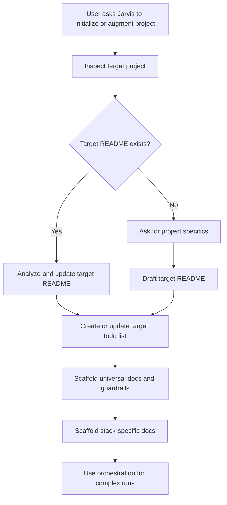

# Jarvis Repurpose Plan

## Scope
This plan has two deliverables:

- Rewrite [`/home/cxiius/Projects/jarvis/README.md`](/home/cxiius/Projects/jarvis/README.md) as Jarvis's high-level transition charter.
- Create a Jarvis-owned Markdown roadmap/todo file, proposed as [`/home/cxiius/Projects/jarvis/docs/jarvis-platform-todo.md`](/home/cxiius/Projects/jarvis/docs/jarvis-platform-todo.md), to preserve the larger platform requirements for future agents and context sessions.

Do not implement the full scaffolding system yet. Do not reorganize existing directories, fix stale links in config files, create runnable generators, or port WFD orchestration files in this pass unless the user explicitly expands scope.

## Guiding Decisions
- Position Jarvis as a project initialization and augmentation platform, not as the old “Agentic AI Development Bible.”
- Add a prominent refactor notice explaining that existing framework/library/rules files may be outdated legacy material until intentionally reviewed or ported.
- Keep the README at 10,000 feet, following WFD’s README governance idea: purpose, principles, boundaries, documentation map, development, and workflow belong here; deep implementation playbooks belong in future internal docs.
- Describe core capabilities as intended product behavior while using transition-safe language so the README does not imply that a CLI, generator, or full orchestration system already exists.
- Treat “README” as two separate artifacts:
  - Jarvis's own root README, which explains what Jarvis is and how the repo is being repurposed.
  - The target project's root README, which Jarvis will create or update when initializing or augmenting another project.
- Treat Jarvis as an initialization aid, not a long-term runtime, documentation, or governance dependency for the target project. After initialization, the target project should stand as an independent repository with its own copied or generated docs, rules, agents, ADRs, and workflows.
- Capture detailed future behavior in the roadmap/todo file so later agents can resume without relying on chat history.

## Deliverable 1: Jarvis Root README

### Proposed README Shape
1. Title and summary
   - `# Jarvis`
   - One concise elevator pitch: Jarvis helps scaffold new or existing projects with universal and stack-specific ADRs, Cursor rules, agents, best practices, documentation, todos, and orchestration support.

2. Refactor notice
   - State that Jarvis is being repurposed.
   - Warn agents and humans that existing files may reflect the previous knowledge-base concept and should not be assumed current.
   - Say WFD is the conceptual template for orchestration and documentation discipline, but WFD-specific stack/product choices should not be copied directly.

3. Project summary
   - Explain the sibling-workspace workflow: use Jarvis from one workspace to initialize or augment another project.
   - Emphasize that Jarvis should help create or revise the target project's root README first, then derive project-specific documentation and guardrails from it.
   - Clarify that sibling-workspace usage is temporary during initialization; the target project should not rely on Jarvis after handoff.

4. Core principles
   - Project-first documentation.
   - Human and agent readability.
   - Universal baseline plus stack-specific specialization.
   - Durable decisions through ADRs.
   - Resumable work through todos and orchestration artifacts.
   - Clear separation between Jarvis templates/patterns and target-project ownership.
   - Target-project independence after initialization.

5. Core capabilities
   - Initialize a new project foundation.
   - Augment an existing project.
   - Draft or update target-project root READMEs.
   - Create and maintain project todos for resumable initialization.
   - Scaffold documentation sets such as ADRs, rules, agent contracts, validation guidance, and workflow files.
   - Support future orchestration for complex initialization runs.

6. Documentation
   - Keep this section intentionally high-level.
   - Mention expected future documentation families: ADRs, rules, agents, orchestration, stack guides, templates, and examples.
   - Avoid linking to stale current paths unless we explicitly label them legacy or “under review.”

7. Development
   - State that development guidance will live in internal docs as the repo is rebuilt.
   - Avoid inventing install/build commands because Jarvis currently has no package manifest.
   - Say contributors should keep README-level content stable and move implementation detail into focused docs.

8. Workflow
   - Outline the intended initialization flow:
     - User prompts Jarvis to initialize or augment a target project.
     - Jarvis inspects or asks for project specifics.
     - Jarvis creates or updates the root README.
     - Jarvis creates a resumable todo list.
     - Jarvis scaffolds universal docs and then stack-specific docs.
     - Complex work may be routed through an orchestration model inspired by WFD.

## Deliverable 2: Jarvis Platform Roadmap/Todo

Create [`/home/cxiius/Projects/jarvis/docs/jarvis-platform-todo.md`](/home/cxiius/Projects/jarvis/docs/jarvis-platform-todo.md) as the durable, resumable planning artifact for the larger repurpose. This file should be detailed enough for another agent to continue the work later.

### Proposed Roadmap/Todo Shape
1. Purpose and status
   - State that the file tracks the Jarvis platform buildout, not a target project's own todo list.
   - State that the root README is the public 10,000 ft charter, while this file carries operational detail.

2. Terminology
   - `Jarvis repository`: the source repo containing templates, rules, agents, and orchestration guidance.
   - `Target project`: the project Jarvis initializes or augments.
   - `Target README`: the target project's root README created or modified by Jarvis.
   - `Project initialization todo`: the target-project task list created by Jarvis to support stop/resume.
   - `Handoff`: the point where the target project has enough self-contained documentation and workflow guidance to continue without Jarvis.

3. Target-project initialization flow
   - User prompts Jarvis to initialize a new project or augment an existing one.
   - Jarvis detects whether a target README exists.
   - If no target README exists, Jarvis asks for project specifics before drafting the 10,000 ft overview.
   - If a target README exists, Jarvis treats it as source material, identifies missing high-level context, and proposes updates.
   - Jarvis creates or updates a target-project todo list for remaining initialization work.
   - Jarvis scaffolds universal documentation first, then stack-specific documentation based on the target README and user answers.
   - Jarvis completes handoff by ensuring generated files do not depend on relative links, live references, or continuing access to the Jarvis repository.

4. Target README responsibilities
   - Describe the project at 10,000 ft.
   - Name the intended tech stack and durable boundaries at a high level.
   - Route implementation detail to internal docs.
   - Provide enough context for agents to infer which ADRs, rules, agents, and best-practices docs are required.
   - Avoid becoming a dumping ground for stack playbooks.
   - Stand alone after initialization without requiring readers or agents to consult Jarvis.

5. Target project todo requirements
   - Record outstanding initialization work in a durable file inside the target project.
   - Use stable IDs so tasks can be resumed across sessions.
   - Separate universal baseline tasks from stack-specific tasks.
   - Track dependencies, blockers, and completion evidence.
   - Update the todo when README changes imply follow-up documentation or orchestration work.

6. Universal scaffolding backlog
   - ADR structure and governance templates.
   - README governance guidance.
   - Documentation conventions.
   - Cursor rules layout and rule index.
   - Agent contracts and handoff prompts.
   - Orchestration artifacts and task-folder templates.
   - Validation checklist and PR/commit guidance.
   - Handoff checklist confirming target-project independence from Jarvis.

7. Stack-specific scaffolding backlog
   - Framework-specific rules and best practices.
   - Tooling commands and validation expectations.
   - Testing strategy and coverage guidance.
   - Runtime, deployment, secrets, and dependency boundaries.
   - Stack-specific ADR prompts where durable architecture decisions are likely.

8. Orchestration model to design later
   - Generalize WFD's Orchestrator, Planner, Builder, Tester, and Validator roles.
   - Generalize task folders, manifests, lifecycle gates, validation reports, and human approval.
   - Keep WFD's product and stack details out of Jarvis defaults.
   - Decide later whether Jarvis remains documentation-first, becomes script-assisted, or gains a CLI/generator.
   - Ensure orchestration artifacts copied into target projects are self-contained and owned by the target project after handoff.

### Suggested Task Categories Inside The File
- `JR-README-*`: Jarvis root README and repository-level positioning.
- `JR-TODO-*`: Jarvis platform roadmap/todo maintenance.
- `JR-TARGET-README-*`: Target-project README creation and update behavior.
- `JR-TARGET-TODO-*`: Target-project todo creation and resume behavior.
- `JR-UNIVERSAL-*`: Universal docs/rules/ADRs/agent scaffolds.
- `JR-STACK-*`: Stack-specific documentation and rules.
- `JR-ORCH-*`: Orchestration model and artifacts.
- `JR-VALIDATION-*`: Validation, test evidence, and review gates.

## Conceptual Flow

## WFD Concepts To Generalize Later
Use WFD as a pattern source for future Jarvis docs, especially:
- Task-folder state under `.cursor/orchestrations/{task-id}/`.
- Manifest-owned resumability.
- Agent roles like Orchestrator, Planner, Builder, Tester, and Validator.
- Lifecycle gates distinct from merge-ready checks.
- Artifact contracts for plan, acceptance criteria, build log, test report, validation report, and human approval.

Do not copy WFD-specific content such as Svelte, Dexie, Supabase, OpenAI, recipe-domain ADRs, WFD gap IDs, or WFD package scripts into the Jarvis README.

## Validation After Implementation
- Re-read the rewritten README for consistency with the requested sections.
- Confirm it does not claim nonexistent runnable tooling.
- Confirm it flags legacy content clearly enough for future agents.
- Re-read the new roadmap/todo file to confirm it distinguishes Jarvis's README from target-project READMEs.
- Confirm the roadmap/todo file is detailed enough to resume the platform buildout without relying on this chat.
- Confirm both documents state that initialized target projects must not retain operational reliance on Jarvis.
- Because this is a Markdown-only change, no project test command is expected unless the user asks for broader validation.