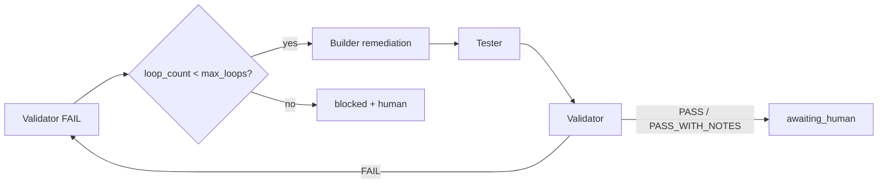

# Loops and rework (`JR-ORCH-006`)

Canonical behavior when **Validator remediation** or **human Gate 6 rework** sends a run back through the pipeline. This document owns **routing**, **manifest counters**, **`gate_status` updates**, and **fresh-session handoff** requirements. Per-file edit rules (append vs replace) stay in [`artifact-ownership.md`](./artifact-ownership.md) (`JR-ORCH-003`).

**Prerequisites:** [`task-manifest.md`](./task-manifest.md), [`artifact-ownership.md`](./artifact-ownership.md), [`gates-and-checks.md`](./gates-and-checks.md), [`init-paths.md`](./init-paths.md)

## Design goals

| Goal | How this document helps |
| --- | --- |
| **Agent efficiency** | Two loop types, two counters, one routing table — no re-deriving from chat or WFD |
| **Fresh-session resume** | Explicit `gate_status` and `current_agent` after each event |
| **Auditability** | `loop_count` / `rework_count` / `rework_history` / append-only `build-log.md` tell the story |
| **Separation** | Validation remediation ≠ human rework ≠ merge-ready (**MG-***) |

## Two loop types (do not conflate)

| Loop type | Trigger | Counter | Typical route | Planner edits? |
| --- | --- | --- | --- | --- |
| **Validation remediation** | `validation-report.md` verdict **FAIL** | `loop_count` (Orchestrator increments when routing to Builder) | Builder → Tester → Validator | **No** — Builder executes **Required remediations** only |
| **Human rework** | Gate 6 `human_approval.status` = `rejected_rework` | `rework_count` + `rework_history[]` | Builder → Tester → Validator, **or** Planner first if scope changed | **Yes** when scope/AC/plan must change |

**Does not increment `loop_count`:**

- Validator **PASS** or **PASS_WITH_NOTES**
- Human `approved` / `approved_with_conditions`
- Human `rejected` (blocked — no Builder loop unless human starts a new directive)
- **Targeted re-runs** (Tester-only or Validator-only) when no Builder remediation is required — see [Partial re-runs](#partial-re-runs)

**Does not increment `rework_count`:**

- Validator **FAIL** remediation (uses `loop_count` only)

## Counter defaults

| Field | Default | Owner | Meaning |
| --- | --- | --- | --- |
| `loop_count` | `0` | Orchestrator | Validator **FAIL** → Builder cycles completed |
| `max_loops` | **`2`** | Orchestrator (init) | Cap; at **FAIL** when `loop_count >= max_loops` → `blocked` + `max_loops_exceeded` |
| `rework_count` | `0` | Orchestrator | Gate 6 `rejected_rework` cycles |
| `rework_history` | `[]` | Orchestrator | One object per human rework — see [`task-manifest.md`](./task-manifest.md#rework-history) |

Targets may document a different `max_loops` in the orchestration guide; the Orchestrator sets it at manifest init. **Do not** raise `max_loops` mid-run without human approval.

## Validation remediation loop

### When it starts

1. Validator completes `validation-report.md` with verdict **FAIL**.
2. Orchestrator reads **Required remediations** (numbered, executable without guessing).
3. If `loop_count < max_loops`: enter remediation (below).
4. Else: `status` → `blocked`, append `max_loops_exceeded` to `flags`, halt for human.

### Manifest and gates (Orchestrator)

Apply in order when routing **FAIL** → Builder:

| Field / key | Set to |
| --- | --- |
| `loop_count` | Increment by **1** (this is the only increment trigger) |
| `status` | `in_progress` |
| `current_agent` | `builder` |
| `gate_5_validation` | `failed` |
| `gate_6_human_approval` | `pending` (if was `awaiting_human`, revert merge-ready wait) |
| `human_approval.status` | `pending` (clear `approved_at`, `approver`, `conditions`, `notes` if stale) |
| `flags` | Remove `max_loops_exceeded` if present from a prior attempt |

**Do not** change `gate_2_plan` or unfreeze Planner artifacts — remediation stays within frozen plan/AC unless human orders replan.

When Builder finishes and Orchestrator routes to Tester:

| Field / key | Set to |
| --- | --- |
| `current_agent` | `tester` |
| `gate_4_tests` | `pending` |
| `gate_5_validation` | `pending` |

After Tester finishes → Validator: `current_agent` → `validator`; `gate_5_validation` → `pending` until Validator completes.

**Remediation continuation (required):** After remediation Builder, route **Tester then Validator**. Do **not** skip Tester on remediation loops unless the target orchestration guide documents an approved exception (human pause — see below).

### Builder inputs (remediation)

Minimum read set for the remediation Builder session (full tables: [`../universal-agents/minimum-read-sets.md`](../universal-agents/minimum-read-sets.md)):

- `task-manifest.json` (`loop_count`, `max_loops`, `locked_artifacts`)
- `plan.md`, `acceptance-criteria.md` (frozen)
- `build-log.md` (append new section — do not delete prior loops)
- `validation-report.md` → **Required remediations** (authoritative fix list)

Builder MUST NOT invoke Planner or expand scope beyond remediations + minimal wiring unless Orchestrator/human replans.

### Artifact behavior (summary)

| Artifact | On remediation loop |
| --- | --- |
| `build-log.md` | **Append** dated section (`## Remediation — loop N — YYYY-MM-DD`) |
| `test-report.md` | **Replace** on each Tester run |
| `validation-report.md` | **Replace** on each Validator run |
| `plan.md` / ACs | **Frozen** (no Planner) |

Full contracts: [`artifact-ownership.md`](./artifact-ownership.md).

### Flow (default pipeline)

## Human Gate 6 rework loop

### When it starts

Human reviews evidence at **Gate 6** and chooses `rejected_rework` (not mere `rejected`).

| Outcome | `status` | Route | Counters |
| --- | --- | --- | --- |
| `approved` | → `complete` (after manifest + `human-approval.md`) | None | — |
| `approved_with_conditions` | → `complete` | None | Record `conditions` |
| `rejected` | → `blocked` | None — human must unstick or abandon run | — |
| `rejected_rework` | → `in_progress` | Builder or Planner per scope | `rework_count` +1, append `rework_history` |

### Manifest and gates (Orchestrator) — `rejected_rework`

| Field / key | Set to |
| --- | --- |
| `rework_count` | Increment by **1** |
| `rework_history` | Append `{ "at", "reason", "routed_to": "builder" \| "planner" }` |
| `status` | `in_progress` |
| `human_approval.status` | `rejected_rework` until rework completes; then reset approval fields to `pending` when re-entering validation path |
| `gate_6_human_approval` | `pending` |
| `gate_5_validation` | `pending` if Validator had passed and human sends work back for re-audit |
| `gate_4_tests` | `pending` when routing includes Tester |
| `current_agent` | `planner` or `builder` per [Planner vs Builder routing](#planner-vs-builder-routing) |

**Do not** increment `loop_count` for human rework.

Record the human directive in `human-approval.md` → **Rework directive** and mirror rationale in `rework_history[].reason`.

### After human rework Builder (or Planner → Builder)

Same continuation as validation remediation: **Builder → Tester → Validator** for the full pipeline unless:

- Small-run path skipped Tester/Validator per [`init-paths.md`](./init-paths.md) (unchanged policy), or
- Documented partial re-run applies.

### Planner vs Builder routing

| Route to **Planner** when | Route to **Builder** when |
| --- | --- |
| Human requests AC/plan/scope change | Fix is implementation/test within frozen AC |
| New files or interfaces not in `plan.md` **Component/file map** | Validator-style remediations still apply but human rejected merge for quality |
| ADR or architecture decision must change | UI/bugfix within existing plan boundaries |
| `rework_history` or human names “replan” | Human names concrete file-level fixes |

When routing to Planner:

- Planner may **replace** `plan.md`, `acceptance-criteria.md`, planned `test-matrix.md` sections.
- Orchestrator sets `gate_2_plan` → `pending` until Planner completes; then `gate_3_build` → `pending` before Builder.
- Append `rework_history` with `routed_to: "planner"`.

## Partial re-runs

Orchestrator may start at a later stage when prior artifacts are still valid (**targeted mode**). Do **not** increment `loop_count` unless Validator **FAIL** routes to Builder.

| Situation | Start at | `loop_count` | Notes |
| --- | --- | --- | --- |
| Test-only fix after **PASS** | Tester | No | Prior `validation-report.md` superseded after new Tester + Validator |
| Re-validate after doc/checklist fix, code unchanged | Validator | No | Confirm `build-log.md` / `test-report.md` still current |
| Validator **FAIL** | Builder | **Yes** (on route) | Full remediation path |
| Human `rejected_rework`, implementation-only | Builder | No (`rework_count` only) | Same B→T→V continuation |

Orchestrator MUST adopt the task folder, verify artifact completeness, and set `current_agent` + `gate_status` to match the chosen stage before handoff.

## Small-run and large-run loops

| Context | Loop behavior |
| --- | --- |
| **Small** path A/B/C | Remediation still respects path: if Validator ran, **FAIL** → Builder; if Validator skipped, human substitute audit at `awaiting_human` — no `loop_count` without Validator **FAIL** |
| **Large** phased work | **`max_loops` per phase** (platform default). At each new phase: reset `loop_count` to `0` (or use phase-scoped counters documented in the target guide). Record active phase in manifest `flags` (e.g. `active_phase: 2`) and in `plan.md` **Phases** table. Human rework that spans phases still uses `rework_count` at run level unless the target guide splits rework per phase. |

See [`init-paths.md`](./init-paths.md) for path matrices.

### Large-run phase transition (Orchestrator)

When starting a new **phase** after the prior phase reached Validator **PASS** / **PASS_WITH_NOTES** (or documented phase gate):

| Field | Action |
| --- | --- |
| `loop_count` | Reset to **`0`** |
| `gate_3_build`, `gate_4_tests`, `gate_5_validation` | Set to **`pending`** for the new phase (keep `gate_2_plan` **passed** if plan covers all phases) |
| `flags` | Update `active_phase` (or equivalent) |
| `completed_stages` | Append phase completion summary before reset |

Do **not** reset `rework_count` or `rework_history` on phase transition unless the human starts a new run.

## Fresh-session handoff (loops)

Every loop handoff MUST include in the Orchestrator directive:

- `task_id`, folder path, `risk_tier`, small-run path letter if applicable
- **Loop context:** `loop_count`, `max_loops`, `rework_count`, and whether this is remediation vs human rework
- For Builder: pointer to **Required remediations** or human **Rework directive**
- Scope allowlist (files from plan map + remediation targets)
- Explicit **do not** expand scope / **do not** edit manifest (for non-Orchestrator roles)
- Stop conditions (output contract + max loops)

## Flags (loop-related)

| Flag | When set |
| --- | --- |
| `max_loops_exceeded` | Validator **FAIL** and `loop_count >= max_loops` |
| `remediation_loop_N` | Optional — target may document `remediation_loop_1`, `_2` for audits |
| `human_rework_N` | Optional — parallel to rework_count |
| `substitute_audit_owner: human` | Small-run Validator skip — not a Builder loop |

Prefer stable names in the target orchestration guide.

## `status` and merge-ready during loops

| Phase | `status` | Merge-ready claim |
| --- | --- | --- |
| Remediation / rework in flight | `in_progress` | **No** |
| Validator **PASS** / **PASS_WITH_NOTES** | `awaiting_human` | Orchestrator may set after **MG-*** path green per [`gates-and-checks.md`](./gates-and-checks.md) |
| Max loops or `rejected` | `blocked` | **No** |
| Gate 6 approved | `complete` | Run closed; PR/CI per team process |

**FAIL** at Gate 5 never satisfies **MG-03**. Looping does not waive **MG-01**–**MG-05**.

## Abandon vs continue

| Situation | Recommendation |
| --- | --- |
| Scope fundamentally wrong | Human pause: new `task_id` vs replan same id |
| `max_loops_exceeded` | `blocked` — human fixes outside pipeline or approves new run |
| Contradictory AC/plan | `blocked` + Planner or new run — do not loop Builder blindly |

Preserve the task folder for audit; do not delete loop history.

## Target adoption

| Step | Action |
| --- | --- |
| 1 | Paraphrase this doc (and counters table) into target `docs/ORCHESTRATED_DEVELOPMENT.md` (or chosen name) |
| 2 | Ensure `.cursor/agents/orchestrator.md` rules reference the target guide’s loop section |
| 3 | Confirm `task-manifest.example.json` includes `loop_count`, `max_loops`, `rework_count`, `rework_history` |
| 4 | Optional topic rule `orchestration-loops` — one paragraph + link to target guide |

## Human input (pause points)

Jarvis or the Orchestrator must **stop and ask** before:

- Setting `max_loops` **greater than 2** for a run or project default.
- Skipping **Tester** on a remediation or human-rework loop (exception to B→T→V).
- Continuing the same `task_id` after **scope abandonment** when a new run is cleaner.
- Routing human rework to **Builder** when the human explicitly requested plan/AC changes (should be Planner).
- Incrementing `loop_count` when Validator did not write **FAIL** (e.g. informal “go fix it” in chat).

Routine remediation within `max_loops`, append-only build logs, and `rework_history` recording do not require extra approval.

## Decisions recorded for `JR-ORCH-006`

| Topic | Decision |
| --- | --- |
| Canonical platform doc | This file — `loops-and-rework.md` |
| Loop types | **Validation remediation** (`loop_count`) vs **human rework** (`rework_count`) |
| `max_loops` default | **2** at manifest init |
| `loop_count` increment | **Only** on Validator **FAIL** → Builder route |
| Remediation path | **Builder → Tester → Validator** (required) |
| Planner on remediation | **No** — human or new run for replan |
| `gate_5_validation` on FAIL | Set **`failed`** when entering remediation |
| Gate 6 stale approval | Clear to **`pending`** when re-entering remediation or rework |
| Partial re-runs | Allowed without `loop_count` when no Builder remediation |
| Large-run loop scope | **`max_loops` per phase** (human-confirmed default for `JR-ORCH-006`) |
| Artifact detail | Remains in [`artifact-ownership.md`](./artifact-ownership.md) |
| WFD source | FAIL / rework / max-loops discipline — no WFD product/stack identifiers |

## Related

| Doc | Role |
| --- | --- |
| [`README.md`](./README.md) | Orchestration pack index |
| [`artifact-ownership.md`](./artifact-ownership.md) | Per-file append/replace/freeze |
| [`task-manifest.md`](./task-manifest.md) | JSON fields |
| [`gates-and-checks.md`](./gates-and-checks.md) | `blocked`, **MG-***, Gate 6 |
| [`init-paths.md`](./init-paths.md) | Small/large paths |
| [`../templates/universal-agents/orchestrator.example.md`](../templates/universal-agents/orchestrator.example.md) | Orchestrator rules |
| [`../templates/orchestration/_template/human-approval.md`](../templates/orchestration/_template/human-approval.md) | Rework directive section |
