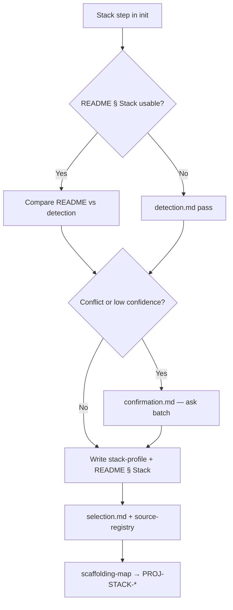

# Stack identification workflow

Jarvis determines a target project's **language, framework, and related stack facts** before stack-specific rules, playbooks, or validation docs are generated. Detection is **evidence-first**: repository files and the target README supply facts; user questions fill gaps and resolve conflicts.

**Platform tasks:** `JR-STACK-001` (detect/confirm), `JR-STACK-002` (select stack rules/docs)  
**Downstream (separate tasks):** `JR-STACK-003` (package manager and commands), `JR-STACK-004`–`007` (testing, runtime, dependencies, legacy review).

**Read order for agents (Jarvis initializing a target project):**

1. Target root `README.md` (if present) — § Technology Stack and § Development
2. [`detection.md`](./detection.md) — run the detection pass; record confidence per field
3. [`confirmation.md`](./confirmation.md) — present summary, ask only for gaps/conflicts; write durable stack record
4. [`selection.md`](./selection.md) + [`source-registry.md`](./source-registry.md) — select and adapt stack rules, playbooks, upstream refs
5. [`../target-readme/scaffolding-map.md`](../target-readme/scaffolding-map.md) — spawn `PROJ-STACK-*` from confirmed stack

**Platform context:** Initialization flow and terminology in [`../roadmap/platform-spec.md`](../roadmap/platform-spec.md). Intake Q5 overlaps when no README exists — see [`../target-readme/intake-questions.md`](../target-readme/intake-questions.md).

## Workflow documents

| ID | Document | Use when |
| --- | --- | --- |
| `JR-STACK-001` | [`detection.md`](./detection.md) | Inspecting the target repo for language, framework, package manager, and datastore signals |
| `JR-STACK-001` | [`confirmation.md`](./confirmation.md) | Turning detection into a user-visible summary, corrections, and target `docs/stack/stack-profile.md` |
| `JR-STACK-002` | [`selection.md`](./selection.md) | Choosing stack-specific rules and best-practices docs from confirmed capabilities |
| `JR-STACK-002` | [`source-registry.md`](./source-registry.md) | Mapping capabilities to Jarvis `frameworks/`, `libraries/`, `ai-agents/` copy sources |
| (target artifacts) | [`../templates/stack-scaffolding/`](../templates/stack-scaffolding/) | `stack-profile`, `upstream-references`, `stack-framework-rule` examples |

## Sequence

## Human input (pause points)

Jarvis must **stop and ask** before:

- Writing stack facts into the target README or `docs/stack/stack-profile.md` when **detection conflicts** (two frameworks claimed, README contradicts lockfiles) — see [`confirmation.md` § Conflicts](./confirmation.md#conflicts).
- Choosing the **primary package root** in a monorepo when multiple apps exist and the user has not named the product path — see [`detection.md` § Monorepos](./detection.md#monorepos).
- Treating **legacy or tutorial folders** as the product stack when the real app lives elsewhere (e.g. `examples/`, `docs/demo/`).
- **Replacing** an existing target `docs/stack/stack-profile.md` that the team adopted as canonical without user approval.

Routine high-confidence detection, a single confirmation batch, and creating `docs/stack/stack-profile.md` from the template do not require extra approval.

## Decisions recorded for `JR-STACK-001`

Defaults favor long-term agent efficiency; override per target when the user directs:

| Topic | Default |
| --- | --- |
| Canonical stack detail (beyond README bullets) | Target `docs/stack/stack-profile.md` |
| README § Technology Stack | High-level only; must agree with stack-profile |
| Infer vs ask | High confidence → record; medium → assumption in confirmation batch; low/conflict → ask before record |
| Stack profiles catalog | **Composed capabilities** — no profile IDs; selection uses [`source-registry.md`](./source-registry.md) (`JR-STACK-002`) |
| Greenfield (no manifests) | Ask intake Q5; do not invent stack |
| Legacy Jarvis `frameworks/` trees | Reference for copy/adapt only; not auto-selected without confirmed capabilities |

## Related material

| Resource | Role |
| --- | --- |
| [`../target-readme/intake-questions.md`](../target-readme/intake-questions.md) | Q5 stack question when README missing |
| [`../universal-docs/README.md`](../universal-docs/README.md) | `docs/stack/source-documentation.md` after language is known |
| Jarvis `frameworks/`, `libraries/`, `ai-agents/` (legacy) | Candidate copy sources — reviewed per `JR-STACK-007` |
| [`../roadmap/open-decisions.md`](../roadmap/open-decisions.md) | Stack profiles catalog; full infer-vs-ask for non-stack fields |
