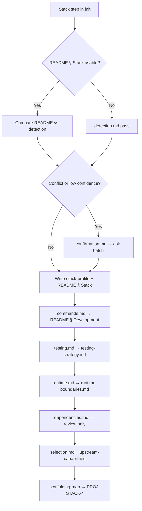

# Stack identification workflow

Jarvis determines a target project's **language, framework, and related stack facts** before stack-specific rules, playbooks, or validation docs are generated. Detection is **evidence-first**: repository files and the target README supply facts; user questions fill gaps and resolve conflicts.

**Platform tasks:** `JR-STACK-001` (detect/confirm), `JR-STACK-002` (select stack rules/docs), `JR-STACK-003` (package manager and commands), `JR-STACK-004` (testing layers), `JR-STACK-005` (runtime and secrets), `JR-STACK-006` (dependency review)  
**Completed:** `JR-STACK-007` — [`legacy-review.md`](./legacy-review.md); upstream index [`upstream-capabilities.md`](./upstream-capabilities.md).

**Read order for agents (Jarvis initializing a target project):**

1. Target root `README.md` (if present) — § Technology Stack and § Development
2. [`detection.md`](./detection.md) — run the detection pass; record confidence per field
3. [`confirmation.md`](./confirmation.md) — present summary, ask only for gaps/conflicts; write durable stack record
4. [`commands.md`](./commands.md) — record package manager and verified scripts (`PROJ-STACK-001`)
5. [`testing.md`](./testing.md) — map test layers and verified commands (`PROJ-STACK-003`)
6. [`runtime.md`](./runtime.md) — runtime, deploy, secrets/env boundaries (`PROJ-STACK-004`)
7. [`dependencies.md`](./dependencies.md) — read-only manifest review (`PROJ-STACK-005`)
8. [`selection.md`](./selection.md) + [`upstream-capabilities.md`](./upstream-capabilities.md) — author target stack rules and upstream refs
9. [`../target-readme/scaffolding-map.md`](../target-readme/scaffolding-map.md) — spawn `PROJ-STACK-*` from confirmed stack

**Platform context:** Initialization flow and terminology in [`../roadmap/platform-spec.md`](../roadmap/platform-spec.md). Intake Q5 overlaps when no README exists — see [`../target-readme/intake-questions.md`](../target-readme/intake-questions.md).

## Workflow documents

| ID | Document | Use when |
| --- | --- | --- |
| `JR-STACK-001` | [`detection.md`](./detection.md) | Inspecting the target repo for language, framework, package manager, and datastore signals |
| `JR-STACK-001` | [`confirmation.md`](./confirmation.md) | Turning detection into a user-visible summary, corrections, and target `docs/stack/stack-profile.md` |
| `JR-STACK-002` | [`selection.md`](./selection.md) | Choosing stack-specific rules and best-practices docs from confirmed capabilities |
| `JR-STACK-002` | [`upstream-capabilities.md`](./upstream-capabilities.md) | Upstream docs and target artifact names per capability |
| `JR-STACK-007` | [`legacy-review.md`](./legacy-review.md) | Legacy framework/library trees removed; decisions recorded |
| `JR-STACK-003` | [`commands.md`](./commands.md) | Package manager and validation commands from manifests — no invented scripts |
| `JR-STACK-004` | [`testing.md`](./testing.md) | Unit / integration / component / browser / e2e layers tied to verified scripts |
| `JR-STACK-005` | [`runtime.md`](./runtime.md) | Adapter, deployment, secrets, and env var boundaries (names only) |
| `JR-STACK-006` | [`dependencies.md`](./dependencies.md) | Prod vs dev deps, duplicate tools, alignment with commands — no auto-upgrades |
| (target artifacts) | [`../templates/stack-scaffolding/`](../templates/stack-scaffolding/) | `stack-profile`, `commands`, `testing-strategy`, `runtime-boundaries`, `upstream-references`, `stack-framework-rule` examples |

## Sequence

## Human input (pause points)

Jarvis must **stop and ask** before:

- Writing stack facts into the target README or `docs/stack/stack-profile.md` when **detection conflicts** (two frameworks claimed, README contradicts lockfiles) — see [`confirmation.md` § Conflicts](./confirmation.md#conflicts).
- Choosing the **primary package root** in a monorepo when multiple apps exist and the user has not named the product path — see [`detection.md` § Monorepos](./detection.md#monorepos).
- Treating **legacy or tutorial folders** as the product stack when the real app lives elsewhere (e.g. `examples/`, `docs/demo/`).
- **Replacing** an existing target `docs/stack/stack-profile.md` that the team adopted as canonical without user approval.
- **Deployment conflicts** (adapter vs Docker vs README) — see [`runtime.md` § Ask table](./runtime.md#ask-table).
- **Changing lockfiles or dependencies** — see [`dependencies.md`](./dependencies.md).

Routine high-confidence detection, a single confirmation batch, and creating `docs/stack/*` from templates do not require extra approval (except where child docs specify pause tables).

## Decisions recorded for `JR-STACK-001`

Defaults favor long-term agent efficiency; override per target when the user directs:

| Topic | Default |
| --- | --- |
| Canonical stack detail (beyond README bullets) | Target `docs/stack/stack-profile.md` |
| README § Technology Stack | High-level only; must agree with stack-profile |
| Infer vs ask | High confidence → record; medium → assumption in confirmation batch; low/conflict → ask before record |
| Stack profiles catalog | **Composed capabilities** — no profile IDs; selection uses [`upstream-capabilities.md`](./upstream-capabilities.md) (`JR-STACK-002`) |
| Command detail beyond README | Target `docs/stack/commands.md` on medium/large init; README § Development stays minimal |
| Testing layer detail | Target `docs/stack/testing-strategy.md` on medium/large when test tooling exists |
| Runtime / secrets detail | Target `docs/stack/runtime-boundaries.md` on medium/large when deploy or secrets split exists |
| Dependency changes | **Never automatic** — review only; user approves manifest edits |
| Greenfield (no manifests) | Ask intake Q5; do not invent stack or scripts |
| Framework/library playbooks in Jarvis | **Out of scope** — target owns stack rules and upstream refs ([`legacy-review.md`](./legacy-review.md)) |

## Related material

| Resource | Role |
| --- | --- |
| [`../target-readme/intake-questions.md`](../target-readme/intake-questions.md) | Q5 stack question when README missing |
| [`../universal-docs/README.md`](../universal-docs/README.md) | `docs/stack/source-documentation.md` after language is known |
| [`../universal-validation/README.md`](../universal-validation/README.md) | **TST-** / **TOOL-** / **DEPLOY-** checklist extensions |
| [`legacy-review.md`](./legacy-review.md) | `JR-STACK-007` inventory and disposition |
| [`../roadmap/open-decisions.md`](../roadmap/open-decisions.md) | Stack profiles catalog; full infer-vs-ask for non-stack fields |
