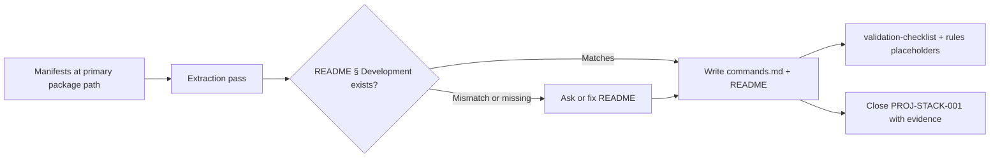

# Package manager and validation commands

Jarvis records **how to install dependencies and run quality checks** in the target project using **only evidence from manifests** — never invented `pnpm test`, `npm run lint`, or framework defaults from Jarvis legacy playbooks.

**Platform task:** `JR-STACK-003`  
**Prerequisite:** `PROJ-STACK-000` complete ([`confirmation.md`](./confirmation.md) — `docs/stack/stack-profile.md` with package manager and primary package path).  
**Related:** [`detection.md`](./detection.md) (names test runners only); [`selection.md`](./selection.md) (strip invented scripts from copied rules); testing layers — `JR-STACK-004`.

## Decision: two surfaces, one source of truth

| Surface | Required when | Role |
| --- | --- | --- |
| Root `README.md` § **Development** | Repo has installable tooling or scripts | **Agent entry point** — prerequisites, package-manager install, dev server, and the **default quality chain** agents run before handoff (typically ≤ 8 command lines) |
| `docs/stack/commands.md` | **Medium** and **large** init; **small** init when scripts are non-obvious (monorepo, many aliases, split check/lint) | **Detailed record** — full script table, evidence paths, per-package paths, optional CI mapping |
| `docs/stack/stack-profile.md` | Always after stack confirm | **Package manager name** and test-runner **names** only — link to `commands.md` for invocations |

**Do not** add a third cheat sheet (for example `docs/CONTRIBUTING.md` command dumps, duplicate tables in every `.mdc`). Rules and validation checklist **cite** README § Development or `docs/stack/commands.md`; they repeat at most **script keys** (`check`, `lint`, `test`) when enforcement needs them.



## Agent read order (command work)

1. `docs/stack/stack-profile.md` — `Primary package path`, `Package manager`
2. This document — run the [extraction pass](#extraction-pass)
3. Manifests at **primary package path** (table below)
4. Root `README.md` § Development — reconcile or create
5. `docs/stack/commands.md` when the [artifact default](#write-target-artifacts) applies
6. `docs/validation-checklist.md` — fill `REPLACE_WITH_VERIFY_COMMANDS` from verified invocations only

## Extraction pass

Run at **`primary_package_path`** from stack-profile (`.` or e.g. `apps/web`).

### 1. Resolve package manager invocation

| Evidence | Record as |
| --- | --- |
| `pnpm-lock.yaml` | `pnpm` / `pnpm run <script>` |
| `package-lock.json` | `npm` / `npm run <script>` |
| `yarn.lock` + `.yarnrc.yml` (Berry) | `yarn` per project config |
| `yarn.lock` (classic) | `yarn` / `yarn run <script>` |
| `bun.lock` / `bunfig.toml` | `bun` / `bun run <script>` |
| `package.json` `"packageManager"` field | Use declared tool and version for **install** docs |
| `pyproject.toml` / `uv.lock` / `poetry.lock` | `uv`, `poetry`, or `pip` per lockfile — see [Python](#python) |
| `go.mod` | `go test ./...`, `go vet`, etc. — **no** `npm`-style scripts |
| `Cargo.toml` | `cargo test`, `cargo clippy`, aliases in `[alias]` |
| `Makefile` | `make <target>` — target must exist in file |
| `composer.json` `scripts` | `composer run-script <name>` |
| Greenfield / no lockfile | **Ask** once; do not invent install lines |

Align **stack-profile** `Package manager` with this row. If lockfile and `package.json#packageManager` disagree, treat as **conflict** ([pause points](#human-input-pause-points)).

### 2. Collect script definitions (by ecosystem)

| Ecosystem | Read first | Script source |
| --- | --- | --- |
| Node (npm/pnpm/yarn/bun) | `{primary}/package.json` | `"scripts"` object keys and values |
| Python | `{primary}/pyproject.toml`, `tox.ini`, `noxfile.py`, `Makefile` | `[project.scripts]`, `[tool.poetry.scripts]`, documented make targets |
| Go | `go.mod`, CI config if present | Standard `go` commands only when used in repo (README, CI, or `Makefile`) |
| Rust | `Cargo.toml` | `[alias]`, default `cargo test` / `cargo clippy` only if referenced |
| Ruby | `Gemfile`, `Rakefile`, `bin/` | `rake` tasks named in README or CI |
| Java/Kotlin | `pom.xml`, `build.gradle*` | Gradle/Maven goals named in README or CI |
| .NET | `*.csproj`, `Directory.Build.props` | `dotnet` CLI targets from repo docs or CI |
| PHP | `composer.json` | `"scripts"` |
| Monorepo | Workspace root + **product** package | Per-package `package.json` at scoped path; label path in commands table |

**Rule:** Every command Jarvis writes must trace to a **key** in `scripts`, a **make target**, a **documented** `go`/`cargo`/`dotnet` invocation in CI/README, or explicit user confirmation. Generic framework docs (“SvelteKit projects usually run `npm run check`”) are **not** evidence.

### 3. Classify scripts (do not invent keys)

Map manifest keys to **roles** for README and `commands.md`. Use the project's **actual script names** in the Invoked as column.

| Role | Typical keys (examples only) | README § Development |
| --- | --- | --- |
| **install** | *(package manager install, not a script)* | Yes — one line |
| **dev** | `dev`, `start`, `serve` | Yes — primary dev server |
| **build** | `build`, `compile` | Optional in README; include in commands.md |
| **check** | `check`, `typecheck`, `verify` | Yes when present — prefer over inventing `tsc` |
| **lint** | `lint`, `eslint` | Yes when separate from check |
| **format** | `format`, `fmt` | commands.md; README only if team uses it in daily flow |
| **test** | `test`, `test:unit`, `test:ci` | Yes — default test entry agents should run |
| **test:e2e** | `test:e2e`, `e2e`, `playwright` | commands.md; README if handoff requires e2e evidence |
| **preview** | `preview`, `start:prod` | commands.md |

When multiple scripts fit one role (e.g. `check` and `lint`), list **all** in `commands.md`; put the **minimal chain** for handoff in README (usually `check` + `lint` + `test` if each exists). Do not collapse into one invented meta-script.

### 4. Build invocations

Format commands as agents can copy-paste:

| Package manager | Pattern |
| --- | --- |
| pnpm | `pnpm install` ; `pnpm run <script>` |
| npm | `npm install` ; `npm run <script>` |
| yarn | `yarn` / `yarn install` ; `yarn <script>` per project |
| bun | `bun install` ; `bun run <script>` |
| poetry | `poetry install` ; `poetry run <script>` |
| uv | `uv sync` ; `uv run <script>` |

Record **working directory** when not repo root: `(from apps/web) pnpm run dev`.

### 5. Compare README § Development

| Situation | Action |
| --- | --- |
| No § Development | Create from verified invocations |
| Commands match manifests | Record; optional one-line README tweak for consistency |
| README command **not** in manifests | **Pause** — remove, fix README, or get user approval to keep custom wrapper |
| Manifest script **not** in README | Add to README if role is install/dev/check/lint/test; else commands.md only |

### 6. Optional execution check

When the environment can run commands safely (dependencies installed, no destructive scripts):

- Run the **default quality chain** once before marking `PROJ-STACK-001` complete.
- Record pass/fail and date in backlog **Evidence** — do not claim pass if not run.

If install fails or CI-only tooling is unavailable, record **Evidence** as manifest inspection only and note `execution: not run` on the task.

## Write target artifacts

### 1. `docs/stack/commands.md`

- Copy from [`commands.example.md`](../templates/stack-scaffolding/commands.example.md).
- Fill script table, package manager, primary path, `last_verified`, evidence paths.
- **No Jarvis links.**

| Init path | commands.md |
| --- | --- |
| **Small** | Optional if README § Development lists all scripts agents need |
| **Medium** / **Large** | Default — required |

### 2. README § Development

Follow [`outline.md`](../target-readme/outline.md) § Development:

- Prerequisites (runtime version from `.nvmrc`, `engines`, `requires-python`, etc. — **from files**, not guessed).
- Install line using verified package manager.
- Dev + quality commands (verified invocations only).
- Env var **names** only when declared in `.env.example`, README, or documented config — never values.

### 3. `docs/stack/stack-profile.md`

- Ensure **Package manager** matches lockfile.
- **Test runners** — names only (from detection); add one line: `Commands: docs/stack/commands.md` (or `README § Development` on small init).

### 4. Downstream placeholders

| Artifact | Update |
| --- | --- |
| `docs/validation-checklist.md` | `REPLACE_WITH_VERIFY_COMMANDS` ← comma-separated **invocations** from README default chain |
| `.cursor/rules/project-stack.mdc` or framework rule | Optional one-line “Common commands” pointing to README or `commands.md` — no invented scripts |
| PR/commit templates | `REPLACE_WITH_VERIFY_COMMAND` from same chain |

### 5. Target `docs/roadmap/backlog.md`

Close **`PROJ-STACK-001`** (package manager and validation commands):

```markdown
- [x] `PROJ-STACK-001`: Document package manager and validation commands from actual project files (do not invent scripts). **required for handoff**
  - Evidence: `package.json` (primary path `.`) inspected 2026-05-19; `docs/stack/commands.md`; README § Development aligned; execution: `pnpm run check`, `pnpm run test` passed.
```

Add `docs/stack/commands.md` to README § Documentation when created.

## Human input (pause points)

Jarvis must **stop and ask** before:

| Situation | Question intent |
| --- | --- |
| README § Development lists commands **absent** from manifests | Remove, replace with verified scripts, or user confirms custom command |
| Two+ scripts for same role with no clear default | Which is the **handoff** check/lint/test command? |
| Monorepo — quality scripts at root vs product package differ | Which path is canonical for agents? |
| No `scripts` / no Makefile / no documented Go-Rust invocations | Omit Development vs user supplies commands |
| Lockfile says pnpm but README says npm | Which is authoritative? |
| Replacing existing `docs/stack/commands.md` the team adopted | Merge vs replace |
| CI uses different commands than local `package.json` | Document both in commands.md with **CI** vs **local** labels; README states default for agents unless user picks CI |

Routine extraction, README sync, and creating `commands.md` from the template do **not** require extra approval.

## Do not ask

| Topic | Reason |
| --- | --- |
| Package manager when lockfile exists | [`intake-questions.md`](../target-readme/intake-questions.md), [`detection.md`](./detection.md) |
| Whether to add `vitest` / `playwright` as tools | Detection + `JR-STACK-004` |
| Exact dependency versions | stack-profile / README stack bullets only when architectural |

## Greenfield and doc-only repos

| State | Behavior |
| --- | --- |
| No manifests | Skip extraction; leave README § Development absent; `PROJ-STACK-001` open |
| Manifests added later | Re-run extraction; update `last_verified` |
| Doc-only init, no `package.json` | No `PROJ-STACK-001` completion until tooling exists or user waives in handoff sign-off |

## Re-verification triggers

Re-run this workflow when:

- `package.json` / lockfile / `pyproject.toml` scripts change
- README § Development edited
- Primary package path changes (monorepo)
- Package manager migration (npm → pnpm, etc.)

Update `last_verified`, evidence paths, and validation checklist placeholders in the **same session**.

## Anti-patterns

| Anti-pattern | Correct action |
| --- | --- |
| `pnpm test` in README with no `"test"` script | Omit or add script in repo first — Jarvis does not add scripts |
| Copying WFD or Jarvis `frameworks/*/README.md` command blocks | Extract from **target** manifests only |
| `npm run` when lockfile is `pnpm-lock.yaml` | Use pnpm invocations |
| Documenting every script including one-off `postinstall` | commands.md may list; README stays minimal |
| Claiming `PROJ-STACK-001` complete without manifest paths in Evidence | Always cite inspected files and date |

## Agent efficiency notes

- **One extraction pass** after stack-profile — store results in `commands.md` so rules and checklist do not re-parse `package.json` every session.
- **README stays short**; agents doing deep stack work open `commands.md`.
- **Stable script keys** in Evidence and checklist (`check`, `lint`, `test`) survive better than full shell lines when the package manager changes — record both key and full invocation in commands.md.
- **Monorepo:** prefix table rows with package path; never assume root scripts apply to the product package.

## WFD and reference repos

What's For Dinner may sit in the same workspace. **Extract commands from the target path only.** WFD scripts are not defaults for other projects.
