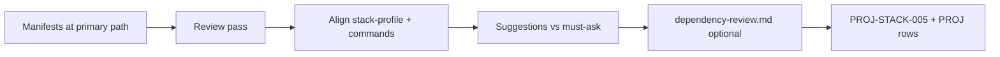

# Dependency and tooling review

Jarvis performs a **read-only review pass** on dependency manifests and aligns **documented tooling** with what the repo actually uses — without upgrading packages or adding tools unless the user approves.

**Platform task:** `JR-STACK-006`  
**Prerequisite:** `PROJ-STACK-000` and `PROJ-STACK-001` recommended ([`stack-profile.md`](../templates/stack-scaffolding/stack-profile.example.md), [`commands.md`](./commands.md)).  
**Related:** [`testing.md`](./testing.md) (no new test runners); [`runtime.md`](./runtime.md) (no new adapters); [`selection.md`](./selection.md) (library rules match manifests).

## Decision: review notes vs separate artifact

| Output | Required when | Role |
| --- | --- | --- |
| Session worksheet (Jarvis — not committed) | Every init with manifests | Findings table for user message |
| `docs/stack/stack-profile.md` | When review changes **capability** rows (UI library, test runners) | Factual capability updates only |
| `docs/stack/commands.md` | When scripts and deps disagree | Re-run commands extraction |
| `docs/stack/dependency-review.md` | **Medium** / **large** when findings are non-trivial; **small** optional | **Durable audit** — prod/dev split, duplicate tools, pin risks, suggested follow-ups |
| Target `docs/roadmap/backlog.md` | Findings need human action | `PROJ-STACK-005` or ad-hoc `PROJ-*` rows — not auto-fixed |

**Hard rule:** Jarvis **must not** run bulk dependency upgrades, change lockfiles, or add packages without **explicit human approval**.



## Agent read order

1. `docs/stack/stack-profile.md` — primary package path
2. `docs/stack/commands.md` — verified scripts
3. This document — run [review pass](#review-pass)
4. Lockfiles and manifests (table below)
5. `docs/validation-checklist.md` — **TOOL-** rows if tooling risks affect handoff

## Review pass

### 1. Identify manifest set

| Ecosystem | Primary files | Lockfile |
| --- | --- | --- |
| Node | `package.json` | `pnpm-lock.yaml`, `package-lock.json`, `yarn.lock`, `bun.lock` |
| Python | `pyproject.toml`, `requirements*.txt` | `uv.lock`, `poetry.lock`, `Pipfile.lock` |
| Go | `go.mod` | `go.sum` |
| Rust | `Cargo.toml` | `Cargo.lock` |
| Ruby | `Gemfile` | `Gemfile.lock` |
| PHP | `composer.json` | `composer.lock` |
| .NET | `*.csproj`, `Directory.Packages.props` | lock via restore |

Monorepo: review **primary package** first; note workspace packages only when they affect the product.

### 2. Prod vs dev classification

| Check | Record finding when |
| --- | --- |
| Runtime dep in `devDependencies` | App imports it in production paths — **suggest** move (ask before change) |
| Test-only dep in `dependencies` | e.g. `vitest` in `dependencies` — **suggest** move to dev |
| Duplicate overlapping tools | `eslint` + legacy `tslint`; `jest` + `vitest` both active |
| Unused dep (heuristic) | Listed dep with zero imports — **low confidence**; say “verify before remove” |
| Missing dep | Imports exist but not in manifest — **high** — ask user (may be transitive) |

Do not run automated “depcheck” unless the project already documents that command in `commands.md`.

### 3. Risky pins and versions

| Signal | Suggestion level |
| --- | --- |
| `"latest"` or `*` version range | **Must ask** before changing |
| Major framework version ≠ registry / docs | Note in review; align stack-profile |
| Abandoned package (clear from README/issue) | **Suggest** replacement — user decides |
| Security advisory known to user/chat | **Must ask** — do not auto-bump |

Jarvis **documents** version facts in stack-profile when **architectural** (e.g. “Svelte 5”); does not chase latest semver.

### 4. Script and tool alignment

Cross-check with [`commands.md`](./commands.md):

| Check | Action |
| --- | --- |
| `package.json` script calls missing binary | Flag; do not add dep without approval |
| `lint` script references eslint but no eslint dep | Flag mismatch |
| CI uses global tool not in repo | Note under CI vs local in commands.md |
| Duplicate formatters (`prettier` + `dprint`) | Document which README/commands cite |

### 5. Output for generated docs

| Target artifact | What to update from review |
| --- | --- |
| `stack-profile.md` | `UI / styling`, `Test runners`, framework version notes |
| `commands.md` | Script table if keys wrong or missing |
| `testing-strategy.md` | Runner list if test deps changed |
| `runtime-boundaries.md` | Adapter/deploy deps (`@sveltejs/adapter-*`) |
| `validation-checklist.md` | **TOOL-** extension: e.g. “lockfile committed”, “no invented scripts” |
| `.cursor/rules/*` | Strip deps not in manifest ([`selection.md`](./selection.md)) |

### 6. Jarvis may suggest vs must ask

| Jarvis may suggest (user decides) | Jarvis must ask before doing |
| --- | --- |
| Move dep between prod/dev | Any version bump or `pnpm up` |
| Remove apparently unused dep | Adding new package |
| Consolidate duplicate linter/test runner | Changing lockfile |
| Add row to `dependency-review.md` | Pinning/unpinning major versions |
| Spawn `PROJ-*` for follow-up | Replacing framework major version |

## Confirmation batch (optional)

Use **one batch** only when classification is unclear:

| # | Question | When |
| --- | --- | --- |
| D1 | **Is** X **required at runtime** or dev-only? | prod/dev mismatch on core import |
| D2 | **Which test runner** is canonical if Jest and Vitest both configured? | Duplicate active configs |
| D3 | **Approve** documenting recommended upgrades as backlog only? | Many outdated minors — no auto-upgrade |

Skip batch when review is clean.

## Write target artifacts

### 1. `docs/stack/dependency-review.md` (optional)

Short sections:

- **Summary** — date, primary path, manifest paths inspected
- **Findings** — table: severity | area | finding | suggested action | user decision
- **Aligned artifacts** — list updated docs
- **No Jarvis links**

### 2. Target backlog

```markdown
- [x] `PROJ-STACK-005`: Dependency and tooling review aligned with manifests (no automatic upgrades). **optional for handoff**
  - Evidence: `package.json`, `pnpm-lock.yaml` reviewed YYYY-MM-DD; `docs/stack/dependency-review.md`; stack-profile test runners match vitest in devDependencies.
```

Mark **required for handoff** only when user or medium/large path mandates it; default **optional**.

Spawn child tasks for non-trivial findings:

```markdown
- [ ] `PROJ-STACK-010`: Move `vitest` to devDependencies (user-approved change).
  - Depends on: `PROJ-STACK-005`
  - Owner: human
```

Use next free `PROJ-STACK-*` id per [`conventions.md`](../target-roadmap/conventions.md).

## Human input (pause points)

Jarvis must **stop and ask** before:

| Situation | Action |
| --- | --- |
| Any lockfile change | Explicit approval |
| Adding/removing dependencies | Explicit approval |
| Major version upgrade | D3 + user approval |
| Deleting `dependency-review.md` the team uses | Merge vs replace |

Read-only review, documentation updates, and **suggested** backlog rows do **not** require approval.

## Re-verification triggers

- Manifest or lockfile change
- Package manager migration
- After user approves and applies a dependency change — re-run review pass

## Anti-patterns

| Anti-pattern | Correct action |
| --- | --- |
| `pnpm update -L` during init | Forbidden without approval |
| Removing deps based on guess | Suggest only |
| Documenting Jarvis/WFD dep versions as target defaults | Target manifests only |
| Fixing security by bumping without user | File `PROJ-*` recommendation |

## Agent efficiency notes

- **One pass** after commands.md — reuse manifest paths in Evidence.
- Keep **dependency-review.md** short; long audits belong in issue tracker.
- **stack-profile** stays the capability index; review file is audit trail.
