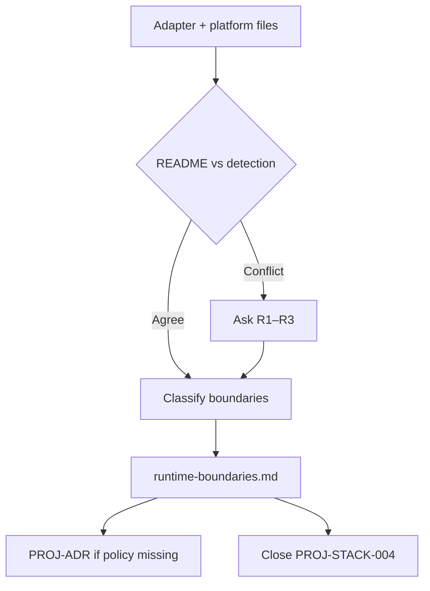

# Runtime, deployment, secrets, and environment boundaries

Jarvis records **where code runs**, **how the app is deployed**, and **what must never reach the client** — from adapter configs, platform files, and README boundaries, not from framework stereotypes.

**Platform task:** `JR-STACK-005`  
**Prerequisite:** `PROJ-STACK-000` complete (`docs/stack/stack-profile.md` with `deployment_hint` when detected).  
**Related:** [`detection.md`](./detection.md#deployment-and-runtime-signals); README § Boundaries; ADRs for secrets — [`scaffolding-map.md`](../target-readme/scaffolding-map.md); env naming — not values.

## Decision: runtime doc vs stack-profile only

| Surface | Required when | Role |
| --- | --- | --- |
| `docs/stack/stack-profile.md` | Always | **Deployment hint** one line (e.g. Netlify, Docker); **Runtime** field when distinct from language |
| `docs/stack/runtime-boundaries.md` | **Medium** and **large** init when deployment, secrets, or split client/server matter; **small** when README § Boundaries already cover secrets | **Canonical boundary record** — adapter, hosting, server-only vs public env, `.env` discipline |
| Root `README.md` § **Boundaries** | When architectural | **Human-facing** summary; must not contradict runtime-boundaries |
| Accepted ADRs | When policy is durable | Client/server, data authority, secret storage — link from runtime doc |

**Do not** paste secret values, API keys, or live `.env` contents into any generated file.



## Agent read order (runtime work)

1. Target `README.md` § Boundaries and § Technology Stack
2. `docs/stack/stack-profile.md` — `Runtime`, `Deployment hint`
3. This document — run the [boundary pass](#boundary-pass)
4. Evidence files (adapters, `vercel.json`, `Dockerfile`, `svelte.config.js`, server entrypoints)
5. `.env.example`, `README`, documented config — **names only**
6. `docs/stack/runtime-boundaries.md` when [artifact default](#write-target-artifacts) applies

## Boundary pass

### 1. Runtime and adapter evidence

| Signal | Record | Notes |
| --- | --- | --- |
| `@sveltejs/adapter-*` in `package.json` | Adapter id (netlify, node, static, vercel, cloudflare) | Primary deploy model for SvelteKit |
| `next.config.*` `output` | static / standalone / serverless | |
| `vercel.json`, `netlify.toml`, `fly.toml` | Platform target | |
| `Dockerfile`, `docker-compose.yml` | Container runtime | Base image if obvious — not a full copy |
| `serverless.yml`, SAM, CDK hints | Serverless | |
| `wrangler.toml` | Cloudflare Workers / Pages | |
| `engines` / `.nvmrc` / `requires-python` | Runtime version for docs | Same as commands.md prerequisites |

Update **stack-profile** `Runtime` and `Deployment hint` to match confirmed facts.

### 2. Execution model (server vs edge vs static)

| Model | Typical signals | Agent guidance |
| --- | --- | --- |
| **Serverless functions** | adapter-netlify/vercel, `+server.ts` API routes | No Node-only APIs in edge-incompatible handlers unless isolated |
| **Node server** | adapter-node, custom `server.js` | Long-lived process assumptions OK in server code |
| **Edge** | adapter-cloudflare, edge middleware | Restrict APIs; document in runtime-boundaries |
| **Static export** | adapter-static, `output: 'export'` | No server secrets at runtime; client-only env rules stricter |
| **Container** | Dockerfile CMD, compose services | Record service boundaries |

When **two models conflict** (e.g. `adapter-netlify` in package.json but `Dockerfile` is the documented production path), **pause** — [R2](#ask-table).

### 3. Secrets and environment variables

Classify each **name** found in `.env.example`, README, or framework docs:

| Class | Meaning | May appear in client bundle? | Example names (illustrative) |
| --- | --- | --- | --- |
| **Secret** | Server-only; never `PUBLIC_` / `VITE_*` exposure | No | `DATABASE_URL`, `OPENAI_API_KEY`, service role keys |
| **Server config** | Server routes/loaders only | No | Internal API base URLs without public prefix |
| **Public config** | Safe for browser when prefixed per framework | Yes, with correct prefix | `PUBLIC_SUPABASE_URL`, `VITE_*` |
| **Build-time** | Injected at build; not runtime secrets | Build pipeline only | Some CI vars |

**Rules:**

- Document **names and class** only — never values.
- If `.env.example` mixes classes without comments, propose grouped sections in runtime doc (do not commit `.env`).
- SvelteKit: `PUBLIC_`; Vite: `VITE_`; Next: `NEXT_PUBLIC_` — record project’s **actual prefix** from docs or existing vars.

### 4. `.env.example` discipline

| Check | Action |
| --- | --- |
| No `.env.example` but README lists env vars | Add `PROJ-DOC-*` or note in runtime doc; **pause** if production deploy implied without template |
| `.env.example` present | Mirror structure in runtime-boundaries (names + class) |
| `.env` in repo | **Warn user** — do not copy; recommend gitignore (out of scope unless user asks) |
| Example values are placeholders | OK (`your-key-here`); flag real-looking secrets for user removal |

### 5. Compare README § Boundaries

| Situation | Action |
| --- | --- |
| README states “no secrets in client” and manifests match | Record; optional ADR if not yet Accepted |
| README silent, adapter implies server routes | Document server-only modules in runtime-boundaries |
| README contradicts adapter (static site + server API keys in client) | **Pause** — fix README or confirm exception |

## Confirmation batch (default)

One message: summary table (runtime, deploy target, secret rules) + assumptions + [Ask table](#ask-table) only.

### Ask table

| # | Question | When |
| --- | --- | --- |
| R1 | **Primary deployment target** for production? | Netlify vs Vercel vs Docker vs “local only” conflict |
| R2 | **Authoritative deploy path** when adapter and Dockerfile/CI disagree? | Conflict on execution model |
| R3 | **Which env vars are public** vs server-only? | `.env.example` ambiguous or missing classes |
| R4 | **Edge vs Node** for API routes? | Multiple adapters or experimental edge config |
| R5 | **Secrets store** (host env, vault, platform dashboard only)? | Enterprise or compliance mention in README |

### Do not ask

| Topic | Reason |
| --- | --- |
| Secret values | Security — never in chat logs or docs |
| Whether to add adapter package | Dependency change — [`dependencies.md`](./dependencies.md) |
| Exact Node version when `engines` is clear | Record from file |

## Write target artifacts

### 1. `docs/stack/runtime-boundaries.md`

- Copy from [`runtime-boundaries.example.md`](../templates/stack-scaffolding/runtime-boundaries.example.md).
- Fill runtime, adapter/platform, execution model, env var table (names only), related ADRs.
- **No Jarvis links.**

| Init path | runtime-boundaries.md |
| --- | --- |
| **Small** | Optional if README § Boundaries + stack-profile suffice |
| **Medium** / **Large** | Default when deploy adapter or secrets split exists |

### 2. README § Boundaries

- Add or align bullets: client/server, secrets, env discipline.
- Do not duplicate full env tables — link `docs/stack/runtime-boundaries.md`.

### 3. `docs/stack/stack-profile.md`

- `Runtime`, `Deployment hint` aligned with runtime doc.
- Related doc link in template “Related target docs” table.

### 4. ADRs and rules

| Need | Action |
| --- | --- |
| Durable secret/client policy | `PROJ-ADR-*` Accepted ADR; runtime doc links to it |
| Agent-enforceable boundary | `PROJ-RULE-*` always-apply or topic rule citing ADR + runtime doc |

### 5. Validation checklist

Add **SEC-** / **DEPLOY-** extension rows when boundaries affect review (e.g. “no `process.env` secret in client bundle” with project-specific check).

### 6. Target backlog row

```markdown
- [x] `PROJ-STACK-004`: Document runtime, deployment target, and secrets/env boundaries (names only). **required for handoff** when deploy tooling or secrets split exists
  - Evidence: `@sveltejs/adapter-netlify`, `netlify.toml` inspected YYYY-MM-DD; `docs/stack/runtime-boundaries.md`; `.env.example` names classified.
```

## Human input (pause points)

Jarvis must **stop and ask** before:

| Situation | Action |
| --- | --- |
| Writing deployment facts that **conflict** across adapter, CI, and README | R1/R2 |
| Classifying a var as **public** when name suggests secret | R3 |
| Replacing team’s `runtime-boundaries.md` | Merge vs replace |
| Suggesting rotation or changing production secrets | User-only |
| Adding new adapter or deploy dependency | [`dependencies.md`](./dependencies.md) |

Recording from evidence, creating template file, and spawning `PROJ-ADR-*` **recommendation** do not require approval.

## Re-verification triggers

- Adapter or platform config changes
- New `PUBLIC_` / `VITE_` vars in `.env.example`
- README § Boundaries edit
- Deploy migration (Netlify → Vercel, etc.)

## Anti-patterns

| Anti-pattern | Correct action |
| --- | --- |
| Pasting `.env` into docs | Names only |
| Assuming Netlify because SvelteKit | Read `svelte.config.js` adapter |
| `navigator.onLine` as secrets boundary | Network hint ≠ auth — see product connectivity rules in target ADRs |
| Client-exposed service role keys | Flag in pause; never mark handoff complete without user fix |

## Agent efficiency notes

- **One canonical file** for env/deploy agents open after README.
- **stack-profile** stays one-line deploy hint for cold start.
- Conflicts **pause early** — avoids wrong rules copied in `PROJ-STACK-002`.
