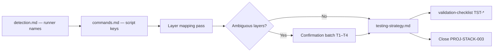

# Testing strategy layers

Jarvis maps **which test layers exist**, **where tests live**, and **which verified commands run each layer** — using evidence from manifests and config files, plus a short confirmation batch when layers are ambiguous.

**Platform task:** `JR-STACK-004`  
**Prerequisite:** `PROJ-STACK-000` complete; `PROJ-STACK-001` recommended ([`commands.md`](./commands.md) — script keys for `test`, `test:unit`, `test:e2e`, etc.).  
**Related:** [`detection.md`](./detection.md) (names runners only); [`commands.md`](./commands.md) (invocations — never invented); validation checklist **TST-** rows — [`universal-validation/README.md`](../universal-validation/README.md).

## Decision: two surfaces, one source of truth

| Surface | Required when | Role |
| --- | --- | --- |
| Root `README.md` § **Development** | Default test command exists | **Agent entry point** — one line for the **default unit/test** command agents run in the handoff chain |
| `docs/stack/testing-strategy.md` | **Medium** and **large** init when any test tooling exists; **small** when multiple layers or non-obvious layout | **Layer map** — which layers apply, folder conventions, verified commands per layer, optional vs required |
| `docs/stack/stack-profile.md` | Always after stack confirm | **Test runners** (names only); link to `testing-strategy.md` or `commands.md` |

**Do not** duplicate full layer tables in every `.mdc` rule or `docs/CONTRIBUTING.md`. Rules cite **layer names** and point to `testing-strategy.md` or README § Development.



## Agent read order (testing work)

1. `docs/stack/stack-profile.md` — `Test runners`, primary package path
2. [`commands.md`](./commands.md) — verified `test*` script keys and invocations
3. This document — run the [layer mapping pass](#layer-mapping-pass)
4. Config and layout evidence (table below) at **primary package path**
5. `docs/stack/testing-strategy.md` when [artifact default](#write-target-artifacts) applies
6. `docs/validation-checklist.md` — fill **TST-** extension rows from verified layers only

## Test layers (definitions)

Jarvis uses these **layer names** consistently in target docs, checklists, and backlog evidence:

| Layer | What it covers | Typical evidence | Usually required? |
| --- | --- | --- | --- |
| **unit** | Pure functions, modules, classes in isolation; mocked I/O | `vitest`, `jest`, `pytest` unit-style configs; `*.test.ts` beside source | **Yes** when test tooling exists |
| **integration** | Multiple modules, DB/API with test doubles or test containers | Separate config or `test/integration/`; `supertest`, DB fixtures | Optional — document if present |
| **component** | UI components in isolation (jsdom/happy-dom) | `@testing-library/*`, `vitest` + `environment: jsdom`, `*.spec.svelte` | Optional for UI projects |
| **browser** | Real browser, component or route tests short of full user journeys | `@playwright/test` component mode, Cypress component | Optional — rare without e2e |
| **e2e** | Full app flows in browser or HTTP black-box | `playwright.config.*`, `cypress`, `test:e2e` script | Optional unless README/CI mandates |

**Rule:** A layer is **in scope** only when the repo has **config, scripts, or a documented folder** for it. Do not add Playwright e2e guidance because the framework “usually” uses it.

## Layer mapping pass

Run at **`primary_package_path`** from stack-profile after [`commands.md`](./commands.md) extraction (or in parallel if scripts are already verified).

### 1. Collect runner and config evidence

| Signal | Layer hint | Record path |
| --- | --- | --- |
| `vitest.config.*` / `jest.config.*` | unit (+ component if `environment: jsdom` or Testing Library) | config path |
| `playwright.config.*` | e2e and/or browser | config path |
| `cypress.config.*` | e2e / component | config path |
| `pytest.ini`, `[tool.pytest]` in `pyproject.toml` | unit / integration via markers or dirs | config path |
| `package.json` scripts `test`, `test:unit`, `test:integration`, `test:e2e` | Map script → layer via [commands.md § Classify scripts](./commands.md#3-classify-scripts-do-not-invent-keys) | `package.json` |
| `tests/`, `__tests__/`, `src/**/*.test.ts` | unit (default layout) | example paths |
| `tests/integration/`, `e2e/`, `playwright/` | integration / e2e | directory |
| `*.spec.svelte`, `*.test.tsx` under `src/lib` | component | example paths |
| CI workflow test steps | Confirms which command CI treats as gate | `.github/workflows/*` |

Align **stack-profile** `Test runners` with tool names found here (not layer names).

### 2. Map scripts to layers

Use **verified script keys** from `docs/stack/commands.md` only:

| If script key exists | Default layer assignment | Pause if |
| --- | --- | --- |
| `test` | **unit** (or project’s only test entry) | README says “integration tests” but only `test` exists |
| `test:unit` | unit | |
| `test:integration` | integration | |
| `test:e2e`, `e2e`, `playwright` | e2e | Same key used for component and e2e |
| `check` / `lint` | Not a test layer — do not list under TST | |

When CI runs a different command than local default, document both in `testing-strategy.md` (**CI** vs **local** labels) — same discipline as [`commands.md`](./commands.md#human-input-pause-points).

### 3. Folder conventions (record, do not invent)

Document **actual** paths from the repo:

| Pattern | When to record |
| --- | --- |
| Colocated `*.test.ts` next to source | Common in Vite/Vitest/SvelteKit |
| `src/lib/**/*.spec.ts` | Svelte/component tests |
| `tests/unit`, `tests/integration` | Explicit split |
| `e2e/` or `playwright/tests` | e2e |
| `__tests__/` at package root | Jest-style |

If the repo has no tests yet, **do not** invent folders — leave layers “not configured” and keep `PROJ-STACK-003` open.

### 4. Mark optional vs required per layer

| Situation | Default |
| --- | --- |
| Script exists and CI runs it | **Required** for that layer in handoff evidence |
| Config exists, no script (e.g. raw `npx playwright test`) | **Optional** unless user confirms daily use; document invocation only if in README/CI/Makefile |
| Testing Library in deps, no tests | **Optional** — note “dependency present, no tests yet” |
| User says e2e is release-only | **Optional** for routine agent handoff; required before release (document in strategy) |

## Confirmation batch (default)

Present **one message** with:

1. **Layer table** — layer | applies? | command (from commands.md) | evidence paths
2. **Assumptions** — e.g. `test` treated as unit-only
3. **Questions** — only rows from [Ask table](#ask-table)
4. **Corrections prompt** — "Reply with corrections or confirm."

Skip questions when manifests, configs, and README agree.

### Ask table

| # | Question | When |
| --- | --- | --- |
| T1 | **Confirm** which script is the default **unit** handoff test (`test` vs `test:unit` vs other)? | Two+ scripts map to unit role |
| T2 | **Are integration tests** in scope for routine agent runs, or only before release? | `test:integration` exists or integration folder present |
| T3 | **Is e2e required** for merge/handoff, or optional? | Playwright/Cypress present; heavy or flaky suite |
| T4 | **Component tests** — separate from unit, or combined under `test`? | Testing Library + ambiguous layout |
| T5 | **Monorepo:** which package path owns e2e? | e2e at repo root but product in `apps/web` |

### Do not ask

| Topic | Reason |
| --- | --- |
| Whether to add Vitest/Playwright | No new dependencies without user approval — [`dependencies.md`](./dependencies.md) |
| Exact test command strings when lockfile script exists | [`commands.md`](./commands.md) |
| Coverage thresholds | Product/CI policy — record only if in repo config |

## Write target artifacts

### 1. `docs/stack/testing-strategy.md`

- Copy from [`testing-strategy.example.md`](../templates/stack-scaffolding/testing-strategy.example.md).
- Fill layer table, folder conventions, commands per layer (from `commands.md`).
- Set `last_verified` and evidence paths.
- **No Jarvis links.**

| Init path | testing-strategy.md |
| --- | --- |
| **Small** | Optional if only one `test` script and colocated unit tests |
| **Medium** / **Large** | Default when test tooling exists |

### 2. README § Development

- Keep **one** default test line (unit/handoff chain).
- Add “See `docs/stack/testing-strategy.md`” in README § Documentation when the file exists.

### 3. `docs/stack/stack-profile.md`

- **Test runners:** names from detection.
- Add: `Testing layers: docs/stack/testing-strategy.md` (or “see commands.md only” on small init).

### 4. Downstream

| Artifact | Update |
| --- | --- |
| `docs/validation-checklist.md` | **TST-** rows per **in-scope** layer; commands from verified invocations |
| `.cursor/rules/*-conventions.mdc` | Optional: “Tests: see testing-strategy.md” — no invented paths |
| Target `docs/roadmap/backlog.md` | Close **`PROJ-STACK-003`** (see below) |

### 5. Target backlog row

```markdown
- [x] `PROJ-STACK-003`: Document testing layers, folders, and verified commands (do not invent runners). **required for handoff** when test tooling exists
  - Evidence: `vitest.config.ts`, `package.json` scripts inspected YYYY-MM-DD; `docs/stack/testing-strategy.md`; default handoff: `pnpm run test`.
```

On **small** init with a single obvious `test` script, mark **optional for handoff** unless user promotes it.

## Human input (pause points)

Jarvis must **stop and ask** before:

| Situation | Question intent |
| --- | --- |
| Documenting a test command **not** in manifests/commands.md | Align with commands workflow first |
| Claiming e2e is required when user has not confirmed | T3 |
| Replacing existing `testing-strategy.md` the team adopted | Merge vs replace |
| Adding new test dependencies or scripts | User approval — [`dependencies.md`](./dependencies.md) |
| README promises “full test suite” but repo has no tests | Fix README or user confirms planned setup |

Routine mapping, creating `testing-strategy.md` from template, and syncing **TST-** rows do **not** require extra approval.

## Re-verification triggers

Re-run when:

- Test configs or `test*` scripts change
- New layer added (e.g. Playwright introduced)
- Primary package path changes
- README § Development test line changes

Update `last_verified`, evidence, and **TST-** rows in the same session.

## Anti-patterns

| Anti-pattern | Correct action |
| --- | --- |
| `pnpm run test:e2e` with no script | Omit — commands.md owns script truth |
| Labeling `check` as a test layer | Typecheck/lint only |
| Copying WFD/Jarvis test folder layout | Record **target** paths only |
| Requiring e2e for every SvelteKit project | Evidence-based optional default |

## Agent efficiency notes

- **commands.md** holds invocations; **testing-strategy.md** holds layer semantics — avoids re-parsing configs each session.
- **One batch** (T1–T5) per init when needed.
- Handoff chain stays minimal (usually `test` only); e2e documented but not implied for every PR.
