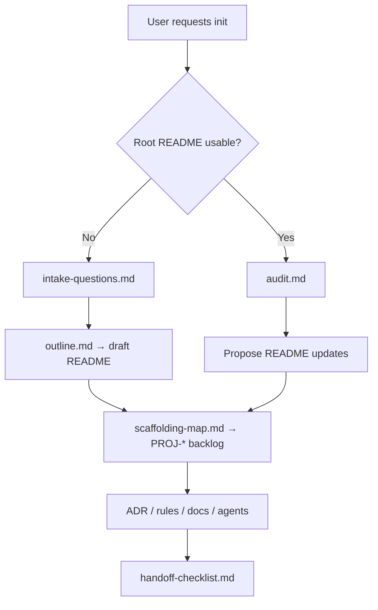

# Target README workflow

Jarvis uses the target project's root `README.md` as the **first durable artifact** in initialization. Everything else (roadmap, ADRs, rules, agents, stack docs) should trace back to statements in that README or to explicit user answers recorded in the roadmap.

**Read order for agents (cold session on a target project):**

1. Target root `README.md`
2. `docs/roadmap/README.md` and `docs/roadmap/backlog.md`
3. The workflow doc for the task at hand (table below)

**Platform context:** Terminology and boundaries live in [`../roadmap/platform-spec.md`](../roadmap/platform-spec.md). Jarvis platform tasks use `JR-*`; target setup tasks use `PROJ-*`.

## Workflow documents

| ID | Document | Use when |
| --- | --- | --- |
| `JR-TARGET-README-001` | [`outline.md`](./outline.md) | Drafting or restructuring a target README; choosing required vs optional sections |
| `JR-TARGET-README-002` | [`intake-questions.md`](./intake-questions.md) | No root README exists (or it is empty / placeholder) |
| `JR-TARGET-README-003` | [`audit.md`](./audit.md) | A README already exists; before proposing edits |
| `JR-TARGET-README-004` | [`scaffolding-map.md`](./scaffolding-map.md) | Turning README content into `PROJ-*` backlog items and downstream files |
| `JR-TARGET-README-005` | [`handoff-checklist.md`](./handoff-checklist.md) | Verifying the README is self-contained (layer 1; see also [`../target-roadmap/handoff.md`](../target-roadmap/handoff.md)) |

## Sequence

## Human input (pause points)

Jarvis must **stop and ask** before:

- Changing product principles, audience, or stated non-negotiables inferred from an existing README (see [`audit.md`](./audit.md)).
- Choosing **large** vs **small** initialization path when signals conflict (see [`scaffolding-map.md`](./scaffolding-map.md)).
- Resolving open platform defaults that affect mandatory scaffolds ([`../roadmap/open-decisions.md`](../roadmap/open-decisions.md) — especially universal scaffold requirements).

Routine drafting, gap lists, and backlog updates do not require extra approval if they follow these docs.

## Related templates

- Target roadmap workflow: [`../target-roadmap/README.md`](../target-roadmap/README.md) — [`readme-sync.md`](../target-roadmap/readme-sync.md), [`handoff.md`](../target-roadmap/handoff.md)
- Target roadmap examples: [`../templates/target-project-roadmap/`](../templates/target-project-roadmap/)
- README skeleton: embedded in [`outline.md`](./outline.md#skeleton)
