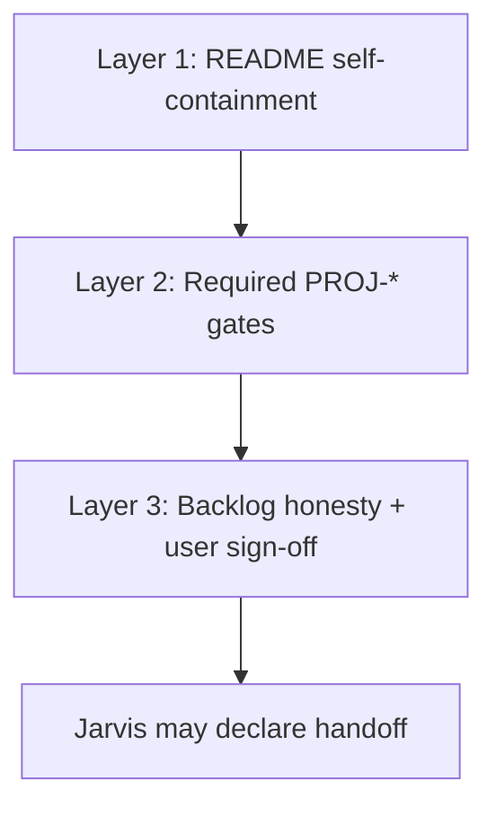

# When backlog work is enough for Jarvis handoff

Criteria for declaring **target-project initialization** complete enough that Jarvis can step away. The target keeps developing with local docs, rules, and an honest backlog — not a fully empty checklist.

**Related:** Platform summary in [`../roadmap/platform-spec.md`](../roadmap/platform-spec.md#handoff-checklist-for-future-jarvis-output); README-only checks in [`../target-readme/handoff-checklist.md`](../target-readme/handoff-checklist.md); task fields in [`conventions.md`](./conventions.md).

---

## What handoff means

| Handoff is | Handoff is not |
| --- | --- |
| Target repo is **self-contained** for normal agent/contributor work | Every `PROJ-*` row is `[x]` |
| **Required** foundation gates are met with evidence | All optional (small-path) scaffolds exist |
| Remaining work is **recorded** in the target backlog | Jarvis stays in the workspace |
| User knows what is **blocking vs optional** before feature work | Product MVP is shipped |

Jarvis may remain available for later questions; handoff means the target **does not depend** on Jarvis paths, templates, or chat history.

---

## Three layers (all required)



### Layer 1 — README self-containment

Run [`../target-readme/handoff-checklist.md`](../target-readme/handoff-checklist.md). All items pass.

Minimum: `PROJ-README-*` tasks marked `[x]` with evidence when non-obvious.

### Layer 2 — Required `PROJ-*` gates

Every task marked **`required for handoff`** on the task line must be `[x]` with an `Evidence:` sub-bullet ([`conventions.md`](./conventions.md#evidence)).

**Default gates** (adjust per init path; mark optional rows without the handoff phrase):

| ID pattern | Typical gate? | Notes |
| --- | --- | --- |
| `PROJ-README-*` | Yes | Draft + routing to `docs/roadmap/` |
| `PROJ-ADR-*` | Medium/large: index + governance; first Accepted ADR as needed | Small path may defer ADRs — **ask user** |
| `PROJ-RULE-*` | At least index + one always-apply rule | Small path minimum |
| `PROJ-DOC-*` | Only if README links require those paths | Unlinked conventions can be post-handoff |
| `PROJ-STACK-*` | Yes when repo has tooling | Commands verified from manifests |
| `PROJ-AGENT-*` / `PROJ-ORCH-*` | Large path only | Optional rows never block |
| `PROJ-HANDOFF-*` | Yes | Repo-wide self-containment + user acknowledgment |

Tasks **without** `**required for handoff**` may stay open after handoff.

### Layer 3 — Backlog honesty and user sign-off

| Check | Requirement |
| --- | --- |
| Open work recorded | Every known gap has an open `PROJ-*`, **Deferred**, or explicit **Cancelled** with reason |
| No silent contradictions | README, ADRs, and backlog agree (run [`readme-sync.md`](./readme-sync.md) if README edited late) |
| `docs/roadmap/README.md` | States **Handoff status: Complete** or **Complete with optional follow-ups** |
| User acknowledgment | `PROJ-HANDOFF-003` `[x]` — user accepts remaining non-handoff tasks |

---

## Jarvis may claim handoff when

All of the following are true:

1. Layer 1 checklist passed.
2. Every `**required for handoff**` task is `[x]` with `Evidence:`.
3. `PROJ-HANDOFF-001` and `PROJ-HANDOFF-002` passed (no Jarvis links in generated docs; rules/agents cite target paths only).
4. `PROJ-HANDOFF-003` passed (`Owner: human`).
5. No open `Blocker:` on any **required for handoff** task.
6. User was told which **optional** `PROJ-*` rows remain open (if any).

**Say to the user (template):**

> Initialization handoff is complete. Required foundation tasks are done. Optional follow-ups: &lt;list open PROJ-* IDs or "none"&gt;. Normal feature work can proceed; use `docs/roadmap/backlog.md` for remaining setup.

---

## Jarvis must not claim handoff when

| Condition | Action |
| --- | --- |
| Any **required for handoff** task is `[ ]` | List blocking IDs; continue or defer with user consent |
| README fails handoff checklist | Fix README or backlog; see [`handoff-checklist.md`](../target-readme/handoff-checklist.md) |
| Generated doc links to Jarvis repo | Complete `PROJ-HANDOFF-001` |
| Rules/agents reference Jarvis paths | Complete `PROJ-HANDOFF-002` |
| Material README edit in same session without backlog sync | Run [`readme-sync.md`](./readme-sync.md) first |
| User has not acknowledged optional remaining work | Complete `PROJ-HANDOFF-003` |
| Handoff phrase removed from gates to "force" complete | Invalid — restore gates or get explicit partial-handoff approval |

---

## Partial handoff (exception)

Only when the **user explicitly accepts** incomplete required gates:

1. Document accepted gaps in `docs/roadmap/README.md` (**Handoff status: Partial — user approved YYYY-MM-DD**).
2. Downgrade or defer specific gates: move tasks to **Deferred** with `Owner: human` and reason — do not mark `[x]` without evidence.
3. Never claim "fully initialized" in prose; use **partial handoff** wording.
4. List every skipped **required for handoff** task by ID.

Jarvis default is **no partial handoff** without user direction.

---

## Init path vs required gates

| Path | Typical **required for handoff** set |
| --- | --- |
| **Small** | `PROJ-README-*`, minimal `PROJ-RULE-*`, `PROJ-STACK-*` (if tooling exists), all `PROJ-HANDOFF-*` |
| **Medium** | Small + `PROJ-ADR-*` (index/governance + boundary ADRs README implies), `PROJ-DOC-*` only for README-linked paths |
| **Large** | Medium + `PROJ-AGENT-*` / `PROJ-ORCH-*` only when user chose large path |

Optional rows titled *(optional for small projects)* never block unless promoted to **required for handoff** with user consent.

When path and README disagree, **pause and ask** ([`readme-sync.md`](./readme-sync.md#initialization-path-adjustments)).

---

## Evidence expectations at handoff

| Task type | Evidence |
| --- | --- |
| **required for handoff** | Required sub-bullet — paths, commands run, or audit date |
| `PROJ-HANDOFF-001` | Note scan: no `jarvis` / `JR-*` in generated target docs (or list fixes) |
| `PROJ-HANDOFF-002` | Sample rule/agent paths verified target-local |
| `PROJ-HANDOFF-003` | User confirmation quoted or paraphrased with date |
| Optional open tasks | No evidence required to hand off |

---

## After handoff

| Item | Guidance |
| --- | --- |
| Open optional `PROJ-*` | Stay on backlog; target team owns completion |
| `docs/roadmap/` in root README | Keep while foundation work continues; archive when user chooses |
| README edits | Target team uses [`readme-sync.md`](./readme-sync.md) without Jarvis |
| New **required for handoff** rows | Avoid adding after handoff unless re-opening initialization |

Update `docs/roadmap/README.md`:

```markdown
**Handoff status:** Complete — optional follow-ups: `PROJ-DOC-002`, `PROJ-STACK-003`.
```

---

## Quick decision table (agents)

| Question | Answer |
| --- | --- |
| Must all `PROJ-*` be done? | No — only **required for handoff** |
| Must README checklist pass? | Yes |
| Can handoff with open `PROJ-DOC-*`? | Yes if not marked required and README links are satisfied or tracked |
| Can handoff with open `PROJ-ORCH-*` on small path? | Yes if optional / cancelled |
| Who approves partial handoff? | Human only (`Owner: human`) |
| What blocks `PROJ-HANDOFF-003`? | Nothing else if layers 1–2 pass — schedule user message last |
