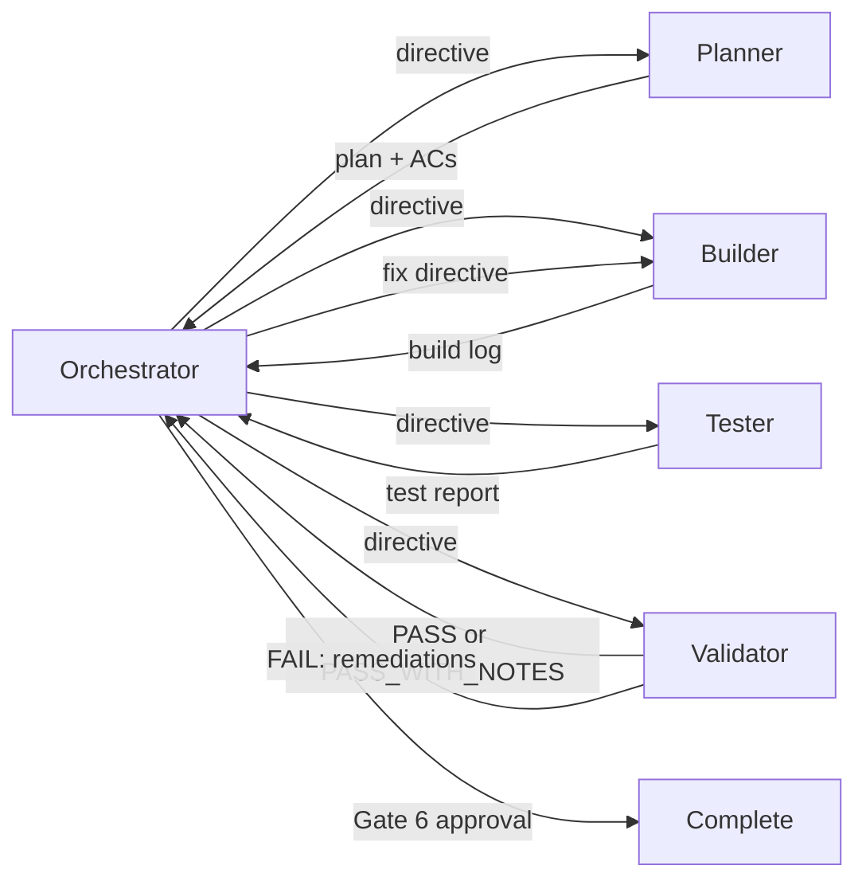

# Agents Index — REPLACE_WITH_PROJECT_NAME

> **Version 1.0.0** | Roster scaffold from Jarvis universal agents pack (`JR-AGENT-001`)

Quick reference for routing work through the task-folder orchestration model. The detailed guide lives in [`REPLACE_WITH_ORCHESTRATION_GUIDE_PATH`](../../REPLACE_WITH_ORCHESTRATION_GUIDE_PATH).

**Role contracts:** Copy from Jarvis universal agents pack (`JR-AGENT-002`) — `orchestrator.example.md`, `planner.example.md`, `builder.example.md`, `tester.example.md`, `validator.example.md` → `.cursor/agents/*.md` (drop `.example` suffix). See [`docs/universal-agents/README.md`](../../universal-agents/README.md).

## Agents

| Agent | Role | Writes code? | Owns artifacts |
| --- | --- | :---: | --- |
| **Orchestrator** | Coordinates the run, enforces gates, updates manifest state, issues directives, records human approval | No | `task-manifest.json`, `human-approval.md` (Gate 6 record) |
| **Planner** | Converts objective into executable scope, interfaces, ADR implications, commands, ACs, and planned test layers | No | `plan.md`, `acceptance-criteria.md`, `test-matrix.md` (planned; required for medium/large or testable code changes) |
| **Builder** | Implements exactly the planned scope and records implementation evidence | Yes | `build-log.md` |
| **Tester** | Maps ACs to tests and records coverage evidence | Test files and harness only | `test-report.md`, `test-matrix.md` (actual) |
| **Validator** | Fresh-context audit using [`REPLACE_WITH_VALIDATION_CHECKLIST_PATH`](../../REPLACE_WITH_VALIDATION_CHECKLIST_PATH) where applicable; verdict and remediations only | No | `validation-report.md` |

**Test runners:** Document verified layers and commands in [`REPLACE_WITH_TEST_MATRIX_PATH`](../../REPLACE_WITH_TEST_MATRIX_PATH) or `docs/stack/testing-strategy.md`. Do not invent runner names or scripts in this index — copy from README § Development and verified manifests only.

## Default pipeline

Orchestrator bookends the run. The manifest `pipeline` array lists stage handoffs only: `planner` → `builder` → `tester` → `validator`.

Validator `FAIL` routes through a fresh Builder session, then Tester, then Validator again. The Orchestrator never self-reviews or self-fixes.

When ADRs apply, cite implications in `plan.md` → **ADR references**; the Validator audits against those ADRs and the project's alignment-gaps doc (path per `adrs/GOVERNANCE.md`).

## Run state

Every run lives under `.cursor/orchestrations/{task-id}/`. The folder slug **must equal** `task_id` in `task-manifest.json`.

| File | Owner | Purpose |
| --- | --- | --- |
| `task-manifest.json` | Orchestrator | Source of truth for status, current agent, gates, loops, locks, sessions, approval. `pipeline` = stage handoffs only; Orchestrator bookends are not in the array. |
| `plan.md` | Planner | Design truth, scope boundary, file map, interfaces, ADR implications |
| `acceptance-criteria.md` | Planner | Stable `AC-01` style criteria for Tester and Validator |
| `test-matrix.md` | Planner (planned) / Tester (actual) | Layer and AC coverage; required for medium/large or testable code changes |
| `build-log.md` | Builder | Files changed, command evidence, deviations, gaps |
| `test-report.md` | Tester | AC-to-test map, uncovered criteria, stability notes, commands |
| `validation-report.md` | Validator | Verdict, evidence, ADR/checklist compliance, regressions, remediations |
| `human-approval.md` | Orchestrator | Gate 6 evidence summary and approval/rework record |

## Lifecycle gates (high level)

Lifecycle gates (0–6) live in `task-manifest.json` → `gate_status`. Merge-ready **MG-*** checks live in the validation checklist and `validation-report.md` — do not conflate them. Full mapping: [`REPLACE_WITH_VALIDATION_CHECKLIST_PATH`](../../REPLACE_WITH_VALIDATION_CHECKLIST_PATH) orchestration appendix.

| Gate | Name | Required for (summary) |
| --- | --- | --- |
| 0 | Intake and risk tier | Every run |
| 1 | Requirements freeze | Planned runs |
| 2 | Executable plan | Planned runs |
| 3 | Build complete | Every code-changing run |
| 4 | Tests mapped | Every code-changing run unless explicitly skipped for a small non-testable change |
| 5 | Validation green | Medium/large runs and small runs when not explicitly skipped |
| 6 | Human approval | Every code-changing run before `complete` |

Small-run skip matrices and `risk_tier.skipped_stages` detail belong in the orchestration guide and platform **`JR-ORCH-005`** — not duplicated here.

## Right-sized flows

| Change size | Example | Pipeline |
| --- | --- | --- |
| **Small** | One-file fix, isolated doc tweak, low-risk UI polish | Orchestrator → Builder → Tester and/or Validator as justified → Orchestrator Gate 6 |
| **Medium** | New module, API behavior change, localized feature | Orchestrator → Planner → Builder → Tester → Validator → Orchestrator Gate 6 |
| **Large** | Multi-phase feature, cross-cutting architecture, security boundaries | Orchestrator → Planner → (Builder → Tester → Validator) × N → Orchestrator Gate 6 |

Planner and Validator should not be skipped for durable architecture, **Accepted** ADR boundaries, security-sensitive changes, or work the Orchestrator classifies as `risk_tier.level: large` without explicit user approval recorded in the manifest.

### Small-run paths (`risk_tier.level: small`)

Record skips in `risk_tier.skipped_stages` and `gate_status`. Gate 6 is always required for code-changing runs. Path A/B/C matrices (Tester vs Validator vs Builder-only, **MG-*** substitutes) live in [`REPLACE_WITH_ORCHESTRATION_GUIDE_PATH`](../../REPLACE_WITH_ORCHESTRATION_GUIDE_PATH) — adapt from Jarvis `init-paths` discipline when scaffolding orchestration.

## Rule bindings (topic rules, not per-role)

This project uses **agent contracts** in `.cursor/agents/*.md` (when present) plus **topic rules** under `.cursor/rules/`. When workflow semantics change, update the agent contract and any referenced topic rule in the same pass.

Fill this table from [`.cursor/rules/index.md`](../rules/index.md) after rules exist. Remove placeholder rows; do not invent rule filenames.

| Agent | Topic rules (representative — replace with target paths) |
| --- | --- |
| Orchestrator | _e.g. orchestration-artifacts, workflow-gates, adr-compliance_ |
| Planner | _e.g. orchestration-artifacts, workflow-gates, test-matrix, adr-compliance_ |
| Builder | _e.g. orchestration-artifacts, workflow-gates, adr-compliance, lint-and-code-quality, domain rules per touched paths_ |
| Tester | _e.g. orchestration-artifacts, workflow-gates, test-matrix, adr-compliance, lint for test files_ |
| Validator | _e.g. orchestration-artifacts, workflow-gates, validation-checklist, adr-compliance_ |

**Cursor rules catalog:** [`.cursor/rules/index.md`](../rules/index.md) — topic `.mdc` files only; agent contracts live under `.cursor/agents/` (or documented alternate path).

## Document precedence

When sources conflict:

1. **Accepted ADRs** and `adrs/GOVERNANCE.md`
2. Target **workflow / merge-ready** rules (when present)
3. **Role contracts** (this folder — `*.md` per role)
4. **Orchestration templates** — `.cursor/orchestrations/_template/`
5. **[`REPLACE_WITH_ORCHESTRATION_GUIDE_PATH`](../../REPLACE_WITH_ORCHESTRATION_GUIDE_PATH)** — human quickstart

## Binding references

| Area | Reference |
| --- | --- |
| Role contract templates | [`orchestrator.example.md`](./orchestrator.example.md), [`planner.example.md`](./planner.example.md), [`builder.example.md`](./builder.example.md), [`tester.example.md`](./tester.example.md), [`validator.example.md`](./validator.example.md) → target `.cursor/agents/*.md` |
| Commands (verified) | [`REPLACE_WITH_COMMANDS_DOC`](../../REPLACE_WITH_COMMANDS_DOC) — e.g. `docs/stack/commands.md`; do not invent scripts in contracts |
| Artifact edit ownership | Target orchestration guide — paraphrase [`artifact-ownership`](../../../orchestration/artifact-ownership.md) (`JR-ORCH-003`); optional `orchestration-artifacts` rule |
| ADR authority | `adrs/INDEX.md`, `adrs/GOVERNANCE.md` |
| Project conventions | `.cursor/rules/index.md`, `docs/documentation-conventions.md` |
| Validation | [`REPLACE_WITH_VALIDATION_CHECKLIST_PATH`](../../REPLACE_WITH_VALIDATION_CHECKLIST_PATH) |
| Test matrix | [`REPLACE_WITH_TEST_MATRIX_PATH`](../../REPLACE_WITH_TEST_MATRIX_PATH) |
| Orchestration guide | [`REPLACE_WITH_ORCHESTRATION_GUIDE_PATH`](../../REPLACE_WITH_ORCHESTRATION_GUIDE_PATH) |

## Common starts

- **Full feature:** Start with Orchestrator, classify tier, create manifest, route Planner.
- **Targeted resume:** Start with Orchestrator, adopt task folder, inspect manifest and artifacts, route the next required role.
- **Validation failure:** Orchestrator reads `validation-report.md`, increments `loop_count` when allowed, routes Builder with Required remediations, then Tester and Validator.
- **Human rework request:** Orchestrator records `rework_history`, increments `rework_count`, clears stale completion approval fields, and routes Builder unless scope changed enough to require Planner.
