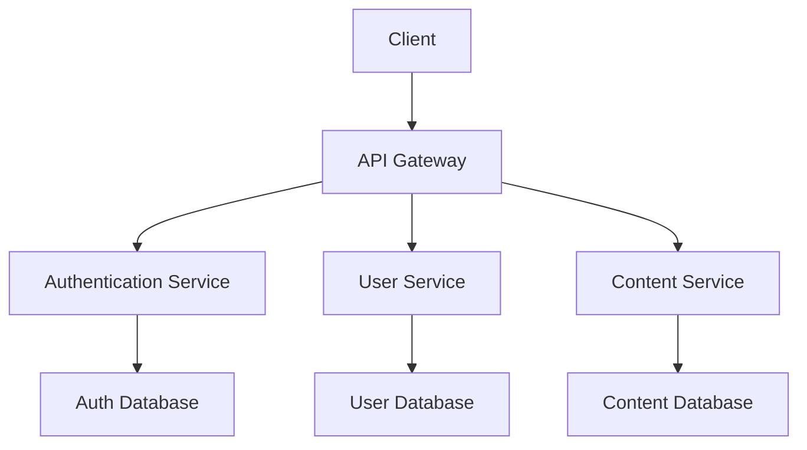

# Documentation Standards Guide

## 🎯 AI Agent Instructions for Documentation

When working with documentation in web development projects, follow these guidelines to ensure comprehensive, clear, and maintainable documentation.

## 📚 Documentation Types

### Project Documentation
1. **README.md** - Project overview and setup instructions
2. **CHANGELOG.md** - Version history and changes
3. **CONTRIBUTING.md** - Contribution guidelines
4. **LICENSE** - Project license information
5. **CODE_OF_CONDUCT.md** - Community guidelines

### Technical Documentation
1. **API Documentation** - API endpoints and usage
2. **Component Documentation** - UI component usage
3. **Architecture Documentation** - System design and patterns
4. **Deployment Documentation** - Deployment procedures
5. **Configuration Documentation** - Configuration options

### User Documentation
1. **User Guide** - End-user instructions
2. **Installation Guide** - Setup and installation
3. **Troubleshooting Guide** - Common issues and solutions
4. **FAQ** - Frequently asked questions
5. **Release Notes** - New features and changes

## 📝 Documentation Standards

### Writing Guidelines
1. **Be clear and concise** - Use simple, direct language
2. **Be consistent** - Use consistent terminology and formatting
3. **Be comprehensive** - Cover all necessary information
4. **Be accurate** - Keep documentation up to date
5. **Be accessible** - Use inclusive language and clear structure
6. **Be searchable** - Use descriptive headings and keywords
7. **Be actionable** - Provide clear steps and examples
8. **Be maintainable** - Structure for easy updates

### Formatting Standards
1. **Use Markdown** - Standard markdown formatting
2. **Use consistent headings** - Follow heading hierarchy
3. **Use code blocks** - Proper syntax highlighting
4. **Use tables** - For structured data
5. **Use lists** - For step-by-step instructions
6. **Use links** - For cross-references
7. **Use images** - For visual explanations
8. **Use badges** - For status and version information

## 📖 README Template

### Project README
```markdown
# Project Name

[](https://github.com/username/project/releases)
[](LICENSE)
[](https://github.com/username/project/actions)
[](https://github.com/username/project/coverage)

A brief description of what the project does and why it's useful.

## 🚀 Quick Start

### Prerequisites

- Node.js 18+ 
- npm 9+ or yarn 1.22+
- Git

### Installation

1. Clone the repository
```bash
git clone https://github.com/username/project.git
cd project
```

2. Install dependencies
```bash
npm install
```

3. Set up environment variables
```bash
cp .env.example .env
# Edit .env with your configuration
```

4. Start the development server
```bash
npm run dev
```

5. Open [http://localhost:3000](http://localhost:3000) in your browser

## 📖 Documentation

- [User Guide](docs/user-guide.md)
- [API Documentation](docs/api.md)
- [Component Documentation](docs/components.md)
- [Deployment Guide](docs/deployment.md)
- [Contributing Guide](CONTRIBUTING.md)

## 🛠️ Available Scripts

| Script | Description |
|--------|-------------|
| `npm run dev` | Start development server |
| `npm run build` | Build for production |
| `npm run test` | Run tests |
| `npm run lint` | Run linter |
| `npm run format` | Format code |

## 🏗️ Project Structure

```
project/
├── src/
│   ├── components/     # React components
│   ├── pages/         # Page components
│   ├── services/      # API services
│   ├── utils/         # Utility functions
│   └── types/         # TypeScript types
├── docs/              # Documentation
├── tests/             # Test files
└── public/            # Static assets
```

## 🤝 Contributing

We welcome contributions! Please see our [Contributing Guide](CONTRIBUTING.md) for details.

## 📄 License

This project is licensed under the MIT License - see the [LICENSE](LICENSE) file for details.

## 🙏 Acknowledgments

- Thanks to [contributor1](https://github.com/contributor1) for [contribution]
- Thanks to [contributor2](https://github.com/contributor2) for [contribution]

## 📞 Support

- 📧 Email: support@example.com
- 💬 Discord: [Join our Discord](https://discord.gg/example)
- 🐛 Issues: [GitHub Issues](https://github.com/username/project/issues)
```

## 🔧 API Documentation Template

### API Endpoint Documentation
```markdown
# API Documentation

## Base URL

```
https://api.example.com/v1
```

## Authentication

All API requests require authentication using a Bearer token in the Authorization header:

```
Authorization: Bearer <your-token>
```

## Endpoints

### Users

#### Get All Users

```http
GET /users
```

**Query Parameters:**

| Parameter | Type | Required | Description |
|-----------|------|----------|-------------|
| `page` | number | No | Page number (default: 1) |
| `limit` | number | No | Items per page (default: 10) |
| `search` | string | No | Search term |
| `role` | string | No | Filter by role |

**Response:**

```json
{
  "data": [
    {
      "id": "1",
      "name": "John Doe",
      "email": "john@example.com",
      "role": "user",
      "createdAt": "2024-01-01T00:00:00Z",
      "updatedAt": "2024-01-01T00:00:00Z"
    }
  ],
  "pagination": {
    "page": 1,
    "limit": 10,
    "total": 100,
    "totalPages": 10
  }
}
```

#### Get User by ID

```http
GET /users/{id}
```

**Path Parameters:**

| Parameter | Type | Required | Description |
|-----------|------|----------|-------------|
| `id` | string | Yes | User ID |

**Response:**

```json
{
  "id": "1",
  "name": "John Doe",
  "email": "john@example.com",
  "role": "user",
  "createdAt": "2024-01-01T00:00:00Z",
  "updatedAt": "2024-01-01T00:00:00Z"
}
```

#### Create User

```http
POST /users
```

**Request Body:**

```json
{
  "name": "John Doe",
  "email": "john@example.com",
  "role": "user"
}
```

**Response:**

```json
{
  "id": "1",
  "name": "John Doe",
  "email": "john@example.com",
  "role": "user",
  "createdAt": "2024-01-01T00:00:00Z",
  "updatedAt": "2024-01-01T00:00:00Z"
}
```

## Error Responses

All error responses follow this format:

```json
{
  "error": {
    "code": "VALIDATION_ERROR",
    "message": "Invalid input data",
    "details": [
      {
        "field": "email",
        "message": "Email is required"
      }
    ]
  }
}
```

**Error Codes:**

| Code | Description |
|------|-------------|
| `VALIDATION_ERROR` | Input validation failed |
| `NOT_FOUND` | Resource not found |
| `UNAUTHORIZED` | Authentication required |
| `FORBIDDEN` | Access denied |
| `INTERNAL_ERROR` | Server error |

## Rate Limiting

API requests are rate limited to 1000 requests per hour per API key.

## SDKs

- [JavaScript SDK](https://github.com/username/js-sdk)
- [Python SDK](https://github.com/username/python-sdk)
- [Go SDK](https://github.com/username/go-sdk)
```

## 🧩 Component Documentation Template

### Component Documentation
```markdown
# Component Documentation

## Button

A customizable button component with multiple variants and sizes.

### Import

```typescript
import { Button } from '@/components/ui/Button';
```

### Props

| Prop | Type | Default | Description |
|------|------|---------|-------------|
| `variant` | `'default' \| 'destructive' \| 'outline' \| 'secondary' \| 'ghost' \| 'link'` | `'default'` | Button variant |
| `size` | `'default' \| 'sm' \| 'lg' \| 'icon'` | `'default'` | Button size |
| `disabled` | `boolean` | `false` | Whether the button is disabled |
| `asChild` | `boolean` | `false` | Render as child component |
| `onClick` | `(event: MouseEvent) => void` | - | Click handler |
| `children` | `React.ReactNode` | - | Button content |

### Variants

#### Default
```tsx
<Button>Default Button</Button>
```

#### Destructive
```tsx
<Button variant="destructive">Delete</Button>
```

#### Outline
```tsx
<Button variant="outline">Outline Button</Button>
```

#### Secondary
```tsx
<Button variant="secondary">Secondary Button</Button>
```

#### Ghost
```tsx
<Button variant="ghost">Ghost Button</Button>
```

#### Link
```tsx
<Button variant="link">Link Button</Button>
```

### Sizes

#### Small
```tsx
<Button size="sm">Small Button</Button>
```

#### Default
```tsx
<Button size="default">Default Button</Button>
```

#### Large
```tsx
<Button size="lg">Large Button</Button>
```

#### Icon
```tsx
<Button size="icon">
  <Icon name="plus" />
</Button>
```

### States

#### Disabled
```tsx
<Button disabled>Disabled Button</Button>
```

#### Loading
```tsx
<Button disabled>
  <Spinner className="mr-2" />
  Loading...
</Button>
```

### Examples

#### With Icon
```tsx
<Button>
  <Icon name="plus" className="mr-2" />
  Add Item
</Button>
```

#### As Link
```tsx
<Button asChild>
  <Link to="/dashboard">Go to Dashboard</Link>
</Button>
```

#### With Click Handler
```tsx
<Button onClick={() => console.log('Clicked!')}>
  Click Me
</Button>
```

### Accessibility

- Supports keyboard navigation
- Includes proper ARIA attributes
- Focus management
- Screen reader support

### Styling

The component uses CSS classes that can be customized:

```css
.button {
  /* Base button styles */
}

.button--primary {
  /* Primary variant styles */
}

.button--secondary {
  /* Secondary variant styles */
}

.button--sm {
  /* Small size styles */
}

.button--lg {
  /* Large size styles */
}
```

### Testing

```typescript
import { render, screen, fireEvent } from '@testing-library/react';
import { Button } from './Button';

test('renders button with text', () => {
  render(<Button>Click me</Button>);
  expect(screen.getByRole('button')).toHaveTextContent('Click me');
});

test('handles click events', () => {
  const handleClick = jest.fn();
  render(<Button onClick={handleClick}>Click me</Button>);
  
  fireEvent.click(screen.getByRole('button'));
  expect(handleClick).toHaveBeenCalledTimes(1);
});
```
```

## 🏗️ Architecture Documentation Template

### System Architecture
```markdown
# System Architecture

## Overview

This document describes the architecture of the application, including system design, component relationships, and data flow.

## Architecture Diagram



## System Components

### Frontend

The frontend is built using React with TypeScript and follows a component-based architecture.

#### Key Technologies
- **React 18** - UI framework
- **TypeScript** - Type safety
- **TailwindCSS** - Styling
- **React Query** - Data fetching
- **React Router** - Routing

#### Architecture Patterns
- **Component Composition** - Reusable UI components
- **Container/Presentational** - Separation of concerns
- **Custom Hooks** - Business logic abstraction
- **Context API** - Global state management

### Backend

The backend follows a microservices architecture with clear separation of concerns.

#### Key Technologies
- **Node.js** - Runtime environment
- **Express.js** - Web framework
- **TypeScript** - Type safety
- **PostgreSQL** - Primary database
- **Redis** - Caching layer

#### Architecture Patterns
- **RESTful API** - HTTP-based communication
- **Repository Pattern** - Data access abstraction
- **Service Layer** - Business logic encapsulation
- **Middleware** - Cross-cutting concerns

## Data Flow

### User Authentication Flow

1. User submits login credentials
2. Frontend sends request to authentication service
3. Service validates credentials against database
4. Service generates JWT token
5. Token is returned to frontend
6. Frontend stores token and redirects user

### Data Fetching Flow

1. Component requests data using React Query
2. Query hook checks cache for existing data
3. If not cached, request is sent to API
4. API service processes request
5. Repository layer queries database
6. Data is returned through service layer
7. Frontend updates component state

## Security

### Authentication
- JWT-based authentication
- Token expiration and refresh
- Secure token storage

### Authorization
- Role-based access control
- Resource-level permissions
- API endpoint protection

### Data Protection
- Input validation and sanitization
- SQL injection prevention
- XSS protection
- CSRF protection

## Performance

### Frontend Optimization
- Code splitting and lazy loading
- Image optimization
- Bundle size optimization
- Caching strategies

### Backend Optimization
- Database query optimization
- Caching layer implementation
- API response compression
- Connection pooling

## Scalability

### Horizontal Scaling
- Load balancer configuration
- Stateless service design
- Database sharding strategy
- CDN implementation

### Vertical Scaling
- Resource monitoring
- Performance profiling
- Bottleneck identification
- Capacity planning

## Monitoring

### Application Monitoring
- Error tracking and logging
- Performance metrics
- User analytics
- Health checks

### Infrastructure Monitoring
- Server resource usage
- Database performance
- Network latency
- Uptime monitoring

## Deployment

### Environment Strategy
- Development environment
- Staging environment
- Production environment
- Environment-specific configurations

### CI/CD Pipeline
- Automated testing
- Code quality checks
- Build and deployment
- Rollback procedures

## Future Considerations

### Planned Improvements
- Microservices migration
- GraphQL implementation
- Real-time features
- Mobile app development

### Technical Debt
- Legacy code refactoring
- Performance optimizations
- Security enhancements
- Documentation updates
```

## 📋 CHANGELOG Template

### Changelog Format
```markdown
# Changelog

All notable changes to this project will be documented in this file.

The format is based on [Keep a Changelog](https://keepachangelog.com/en/1.0.0/),
and this project adheres to [Semantic Versioning](https://semver.org/spec/v2.0.0.html).

## [Unreleased]

### Added
- New feature descriptions

### Changed
- Changes to existing functionality

### Deprecated
- Features that will be removed

### Removed
- Features that were removed

### Fixed
- Bug fixes

### Security
- Security improvements

## [1.2.0] - 2024-01-15

### Added
- User profile management
- Dark mode support
- Export functionality
- New API endpoints

### Changed
- Updated UI components
- Improved performance
- Enhanced error handling

### Fixed
- Fixed login issue on mobile
- Resolved data synchronization bug
- Corrected validation errors

## [1.1.0] - 2024-01-01

### Added
- User authentication
- Basic CRUD operations
- Responsive design

### Changed
- Updated dependencies
- Improved code structure

### Fixed
- Fixed initial setup issues
- Resolved styling conflicts

## [1.0.0] - 2023-12-01

### Added
- Initial release
- Core functionality
- Basic documentation
```

## 🤝 Contributing Guide Template

### Contributing Guidelines
```markdown
# Contributing Guide

Thank you for your interest in contributing to this project! This guide will help you get started.

## Code of Conduct

This project follows a code of conduct. By participating, you agree to uphold this code.

## Getting Started

### Prerequisites

- Node.js 18+
- npm 9+ or yarn 1.22+
- Git

### Setup

1. Fork the repository
2. Clone your fork
```bash
git clone https://github.com/your-username/project.git
cd project
```

3. Install dependencies
```bash
npm install
```

4. Create a new branch
```bash
git checkout -b feature/your-feature-name
```

## Development Process

### Making Changes

1. Make your changes
2. Write tests for new functionality
3. Ensure all tests pass
```bash
npm test
```

4. Run the linter
```bash
npm run lint
```

5. Format your code
```bash
npm run format
```

### Commit Messages

Follow the [Conventional Commits](https://conventionalcommits.org/) specification:

```
type(scope): description

[optional body]

[optional footer(s)]
```

Examples:
- `feat(auth): add OAuth2 integration`
- `fix(ui): resolve button alignment issue`
- `docs(readme): update installation instructions`

### Pull Request Process

1. Push your changes to your fork
2. Create a pull request
3. Fill out the pull request template
4. Request review from maintainers
5. Address any feedback
6. Wait for approval and merge

## Pull Request Template

```markdown
## Description
Brief description of the changes made.

## Type of Change
- [ ] Bug fix (non-breaking change which fixes an issue)
- [ ] New feature (non-breaking change which adds functionality)
- [ ] Breaking change (fix or feature that would cause existing functionality to not work as expected)
- [ ] Documentation update

## Testing
- [ ] Unit tests pass
- [ ] Integration tests pass
- [ ] Manual testing completed

## Checklist
- [ ] Code follows the project's style guidelines
- [ ] Self-review of the code has been performed
- [ ] Code has been commented, particularly in hard-to-understand areas
- [ ] Corresponding changes to the documentation have been made
- [ ] Changes generate no new warnings
- [ ] New and existing unit tests pass locally

## Screenshots (if applicable)
Add screenshots to help explain your changes.

## Related Issues
Closes #123
```

## Issue Templates

### Bug Report
```markdown
**Describe the bug**
A clear and concise description of what the bug is.

**To Reproduce**
Steps to reproduce the behavior:
1. Go to '...'
2. Click on '....'
3. Scroll down to '....'
4. See error

**Expected behavior**
A clear and concise description of what you expected to happen.

**Screenshots**
If applicable, add screenshots to help explain your problem.

**Environment:**
- OS: [e.g. Windows 10]
- Browser: [e.g. Chrome 91]
- Version: [e.g. 1.2.0]

**Additional context**
Add any other context about the problem here.
```

### Feature Request
```markdown
**Is your feature request related to a problem? Please describe.**
A clear and concise description of what the problem is.

**Describe the solution you'd like**
A clear and concise description of what you want to happen.

**Describe alternatives you've considered**
A clear and concise description of any alternative solutions or features you've considered.

**Additional context**
Add any other context or screenshots about the feature request here.
```

## Documentation Standards

### Writing Guidelines
1. **Be clear and concise** - Use simple, direct language
2. **Be consistent** - Use consistent terminology and formatting
3. **Be comprehensive** - Cover all necessary information
4. **Be accurate** - Keep documentation up to date
5. **Be accessible** - Use inclusive language and clear structure

### Formatting Standards
1. **Use Markdown** - Standard markdown formatting
2. **Use consistent headings** - Follow heading hierarchy
3. **Use code blocks** - Proper syntax highlighting
4. **Use tables** - For structured data
5. **Use lists** - For step-by-step instructions

## Getting Help

- 📧 Email: maintainers@example.com
- 💬 Discord: [Join our Discord](https://discord.gg/example)
- 🐛 Issues: [GitHub Issues](https://github.com/username/project/issues)

## Recognition

Contributors will be recognized in:
- README.md
- Release notes
- Project documentation
```

## 🎯 Documentation Best Practices

### General Guidelines
1. **Keep documentation up to date** - Update docs with code changes
2. **Use clear and concise language** - Avoid jargon and complex terms
3. **Provide examples** - Show how to use features
4. **Include screenshots** - Visual aids for complex processes
5. **Use consistent formatting** - Follow established patterns
6. **Make it searchable** - Use descriptive headings and keywords
7. **Test documentation** - Verify instructions work
8. **Get feedback** - Review with team members

### Maintenance Guidelines
1. **Regular reviews** - Schedule documentation reviews
2. **Version control** - Track documentation changes
3. **Automation** - Use tools to generate docs from code
4. **Feedback loops** - Collect user feedback on docs
5. **Metrics** - Track documentation usage
6. **Training** - Train team on documentation standards
7. **Tools** - Use appropriate documentation tools
8. **Process** - Establish documentation processes

## 🎯 AI Agent Best Practices

When assisting with documentation:

1. **Follow established templates** and formats
2. **Use clear and concise language** throughout
3. **Provide comprehensive examples** and code samples
4. **Maintain consistent formatting** and structure
5. **Include all necessary information** for users
6. **Use appropriate documentation types** for different purposes
7. **Keep documentation up to date** with code changes
8. **Follow the established documentation standards** for the project
9. **Use proper markdown formatting** and syntax
10. **Include relevant links and cross-references** for better navigation

## 🔗 Additional Resources

- [Documentation Guide](https://documentation-guide.org/)
- [Markdown Guide](https://markdownguide.org/)
- [Technical Writing](https://technical-writing.org/)
- [API Documentation](https://api-documentation.org/)
- [Component Documentation](https://component-docs.org/)
